# AI Sales Automation Platform — Engineering Plan

> **Project Codename:** SalesAI  
> **Version:** 1.0 Draft  
> **Author:** Staff Engineer  
> **Date:** 2026-07-21

---

## Table of Contents

1. [Product Vision](#1-product-vision)
2. [MVP Scope](#2-mvp-scope)
3. [Future Roadmap](#3-future-roadmap)
4. [System Architecture](#4-system-architecture)
5. [High-Level Architecture Diagram](#5-high-level-architecture-diagram)
6. [Folder Structure](#6-folder-structure)
7. [Backend Architecture](#7-backend-architecture)
8. [Frontend Architecture](#8-frontend-architecture)
9. [Database Design](#9-database-design)
10. [Entity Relationship Diagram](#10-entity-relationship-diagram)
11. [Domain Models](#11-domain-models)
12. [API Design](#12-api-design)
13. [Authentication Flow](#13-authentication-flow)
14. [Authorization Strategy](#14-authorization-strategy)
15. [AI Architecture](#15-ai-architecture)
16. [Prompt Architecture](#16-prompt-architecture)
17. [Background Job Architecture](#17-background-job-architecture)
18. [Automation Flow Design](#18-automation-flow-design)
19. [Sequence Diagrams](#19-sequence-diagrams)
20. [Database Schema](#20-database-schema)
21. [Development Phases](#21-development-phases)
22. [Sprint Plan](#22-sprint-plan)
23. [Git Branch Strategy](#23-recommended-git-branch-strategy)
24. [Coding Standards](#24-coding-standards)
25. [UI/UX Guidelines](#25-uiux-guidelines)
26. [Security Best Practices](#26-security-best-practices)
27. [Logging Strategy](#27-logging-strategy)
28. [Error Handling Strategy](#28-error-handling-strategy)
29. [Deployment Architecture](#29-deployment-architecture)
30. [Azure Deployment Plan](#30-azure-deployment-plan)
31. [Docker Strategy](#31-docker-strategy)
32. [Testing Strategy](#32-testing-strategy)
33. [Future Scalability Plan](#33-future-scalability-plan)
34. [Technical Risks](#34-technical-risks)
35. [Nice-to-Have Features](#35-nice-to-have-features)

---

## 1. Product Vision

### What It Is

**SalesAI** is an AI-first Sales Automation Platform that embeds artificial intelligence directly into every sales workflow — not as a chatbot bolted to the side, but as a **Sales Copilot** that scores leads, researches companies, drafts outreach, summarizes meetings, and recommends next-best-actions — all automatically.

### Why It Exists

Modern sales teams drown in manual tasks: qualifying leads, researching prospects, writing emails, updating CRM records, following up. These repetitive tasks steal time from what salespeople should do — **sell**. Existing CRMs bolt AI on as an afterthought. SalesAI treats AI as a first-class citizen in every workflow.

### Product Principles

| Principle | Meaning |
|---|---|
| **AI-First, Not AI-Bolted** | Every feature is designed to be enhanced or driven by AI |
| **Automate the Boring** | Repetitive CRM hygiene, follow-ups, and data entry are automated |
| **Explainable AI** | Every AI recommendation explains *why* — no black boxes |
| **Progressive Automation** | Start as a Copilot (suggestions), evolve into an Agent (autonomous actions) |
| **Enterprise-Ready from Day One** | RBAC, audit trails, tenant-isolation-ready architecture |

### Target Users

- SDRs (Sales Development Representatives) — lead qualification and outreach
- Account Executives — pipeline management and deal strategy
- Sales Managers — performance insights and team coaching
- Revenue Operations — reporting and automation workflows

### Long-Term Vision

```
Phase 1 (MVP)    → AI Sales Copilot    — AI suggests, human acts
Phase 2 (v2)     → AI Sales Analyst    — AI generates reports and strategies autonomously
Phase 3 (v3)     → AI Sales Agent      — AI executes workflows end-to-end with human oversight
```

---

## 2. MVP Scope

The MVP must be buildable in ~1 week with AI-assisted development while demonstrating senior-level architecture. The scope is ruthlessly prioritized.

### MVP Features — In Scope

| Module | Features Included |
|---|---|
| **Authentication** | Register, Login, JWT + Refresh Token, Role-based auth (Admin, Manager, Sales Rep) |
| **Dashboard** | KPI cards (Revenue, Conversion Rate, Pipeline Value, New Leads, Won Deals), Charts (pipeline funnel, lead sources), Recent activity feed |
| **Lead Management** | CRUD, Lead Status (New/Contacted/Qualified/Unqualified/Converted/Lost), Tags, Notes, Timeline, CSV Import, Duplicate detection (email-based) |
| **Customer Management** | Companies (CRUD), Contacts linked to companies, Communication timeline |
| **Sales Pipeline** | Kanban board (New Lead → Qualified → Proposal → Negotiation → Won/Lost), Drag & drop stage transitions, Deal value and close date |
| **Tasks** | Create/Edit/Delete tasks (Call, Meeting, Follow-up), Link to Lead/Deal/Contact, Due date and reminders |
| **Reports** | Conversion funnel, Revenue by period, Lead source performance, Pipeline value by stage |
| **AI: Lead Scoring** | Auto-score leads (Hot/Warm/Cold) with explanation |
| **AI: Company Research** | Given company name/URL → summary, industry, pain points, pitch suggestions |
| **AI: Email Generator** | Personalized cold outreach based on lead/company context |
| **AI: Meeting Summary** | Paste transcript → summary, action items, risks, next steps |
| **AI: Sales Playbook** | Per-lead recommended channel, timing, approach, objections |
| **Automation** | Lead Created → AI Score → Generate Email Draft → Create Follow-up Task → Notify |

### MVP Features — Explicitly Deferred

| Feature | Reason |
|---|---|
| AI Weekly Sales Insights | Requires historical data accumulation — Phase 2 |
| Calendar Integration | External OAuth complexity — Phase 2 |
| Email/LinkedIn Integration | External APIs — Phase 2 |
| Multi-tenancy | Architectural hooks only — Phase 2 |
| Subscription Billing | Phase 3 |
| Webhooks / MCP | Phase 3 |
| Voice AI | Phase 3 |

---

## 3. Future Roadmap

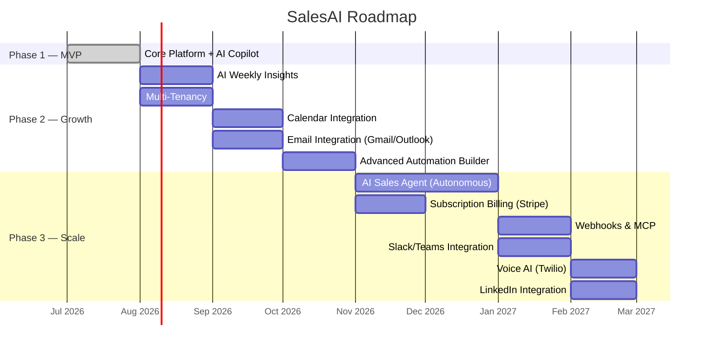

---

## 4. System Architecture

### Architecture Style: Modular Monolith

> [!IMPORTANT]
> **Why Modular Monolith over Microservices?**
>
> For a 1-week MVP built by a small team, microservices introduce network complexity, distributed debugging, and deployment overhead that provides zero benefit at this scale. A modular monolith gives us:
> - Clean domain boundaries (ready to extract to services later)
> - Single deployment unit (simple CI/CD)
> - Shared database with logical separation
> - In-process communication (no gRPC/HTTP overhead)
>
> The module boundaries are designed so any module can be extracted into a standalone service when scale demands it.

### Architecture Layers

```
┌─────────────────────────────────────────────────────────┐
│                     PRESENTATION                         │
│            Angular SPA  ←→  ASP.NET Core API             │
├─────────────────────────────────────────────────────────┤
│                     APPLICATION                          │
│        Commands / Queries (CQRS via MediatR)             │
│        Validators (FluentValidation)                     │
│        DTOs / Mapping (Mapster)                          │
├─────────────────────────────────────────────────────────┤
│                       DOMAIN                             │
│        Entities, Value Objects, Domain Events            │
│        Enums, Business Rules, Specifications             │
├─────────────────────────────────────────────────────────┤
│                    INFRASTRUCTURE                        │
│        EF Core (SQL Server), Redis Cache                 │
│        AI Service (OpenAI), Hangfire, Email Service      │
│        File Storage, External API Clients                │
├─────────────────────────────────────────────────────────┤
│                   CROSS-CUTTING                          │
│        Logging (Serilog), Auth (JWT), Error Handling     │
│        Middleware, Correlation IDs, Health Checks        │
└─────────────────────────────────────────────────────────┘
```

---

## 5. High-Level Architecture Diagram

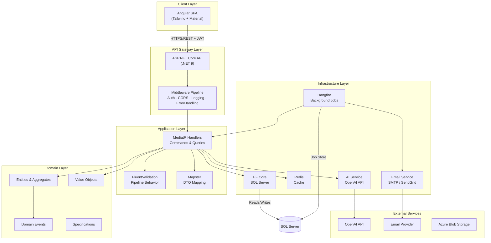

---

## 6. Folder Structure

### Solution Structure (Backend)

```
SalesAI/
├── src/
│   ├── SalesAI.Domain/                          # Domain Layer — ZERO dependencies
│   │   ├── Entities/
│   │   │   ├── Lead.cs
│   │   │   ├── Company.cs
│   │   │   ├── Contact.cs
│   │   │   ├── Deal.cs
│   │   │   ├── SalesTask.cs
│   │   │   ├── Activity.cs
│   │   │   ├── Note.cs
│   │   │   ├── Tag.cs
│   │   │   └── User.cs
│   │   ├── ValueObjects/
│   │   │   ├── Email.cs
│   │   │   ├── PhoneNumber.cs
│   │   │   ├── Money.cs
│   │   │   └── LeadScore.cs
│   │   ├── Enums/
│   │   │   ├── LeadStatus.cs
│   │   │   ├── DealStage.cs
│   │   │   ├── TaskType.cs
│   │   │   ├── TaskPriority.cs
│   │   │   ├── ActivityType.cs
│   │   │   └── UserRole.cs
│   │   ├── Events/
│   │   │   ├── LeadCreatedEvent.cs
│   │   │   ├── LeadScoredEvent.cs
│   │   │   ├── DealStageChangedEvent.cs
│   │   │   └── TaskCompletedEvent.cs
│   │   ├── Exceptions/
│   │   │   ├── DomainException.cs
│   │   │   └── BusinessRuleViolationException.cs
│   │   ├── Common/
│   │   │   ├── BaseEntity.cs
│   │   │   ├── AuditableEntity.cs
│   │   │   ├── IDomainEvent.cs
│   │   │   └── IHasDomainEvents.cs
│   │   └── SalesAI.Domain.csproj
│   │
│   ├── SalesAI.Application/                     # Application Layer
│   │   ├── Common/
│   │   │   ├── Interfaces/
│   │   │   │   ├── IApplicationDbContext.cs
│   │   │   │   ├── IAIService.cs
│   │   │   │   ├── IEmailService.cs
│   │   │   │   ├── ICacheService.cs
│   │   │   │   ├── ICurrentUserService.cs
│   │   │   │   └── IDateTimeProvider.cs
│   │   │   ├── Behaviors/
│   │   │   │   ├── ValidationBehavior.cs
│   │   │   │   ├── LoggingBehavior.cs
│   │   │   │   └── PerformanceBehavior.cs
│   │   │   ├── Models/
│   │   │   │   ├── Result.cs
│   │   │   │   ├── PaginatedList.cs
│   │   │   │   └── PagedQuery.cs
│   │   │   ├── Mappings/
│   │   │   │   └── MappingConfig.cs
│   │   │   └── Exceptions/
│   │   │       ├── NotFoundException.cs
│   │   │       ├── ForbiddenException.cs
│   │   │       └── ValidationException.cs
│   │   ├── Features/
│   │   │   ├── Auth/
│   │   │   │   ├── Commands/
│   │   │   │   │   ├── Register/
│   │   │   │   │   │   ├── RegisterCommand.cs
│   │   │   │   │   │   ├── RegisterCommandHandler.cs
│   │   │   │   │   │   └── RegisterCommandValidator.cs
│   │   │   │   │   ├── Login/
│   │   │   │   │   │   ├── LoginCommand.cs
│   │   │   │   │   │   ├── LoginCommandHandler.cs
│   │   │   │   │   │   └── LoginCommandValidator.cs
│   │   │   │   │   └── RefreshToken/
│   │   │   │   │       ├── RefreshTokenCommand.cs
│   │   │   │   │       └── RefreshTokenCommandHandler.cs
│   │   │   │   └── DTOs/
│   │   │   │       ├── AuthResponseDto.cs
│   │   │   │       └── UserDto.cs
│   │   │   ├── Leads/
│   │   │   │   ├── Commands/
│   │   │   │   │   ├── CreateLead/
│   │   │   │   │   ├── UpdateLead/
│   │   │   │   │   ├── DeleteLead/
│   │   │   │   │   └── ImportLeads/
│   │   │   │   ├── Queries/
│   │   │   │   │   ├── GetLeads/
│   │   │   │   │   ├── GetLeadById/
│   │   │   │   │   └── SearchLeads/
│   │   │   │   ├── EventHandlers/
│   │   │   │   │   └── LeadCreatedEventHandler.cs
│   │   │   │   └── DTOs/
│   │   │   │       ├── LeadDto.cs
│   │   │   │       ├── LeadDetailDto.cs
│   │   │   │       └── LeadListDto.cs
│   │   │   ├── Companies/
│   │   │   │   ├── Commands/
│   │   │   │   ├── Queries/
│   │   │   │   └── DTOs/
│   │   │   ├── Contacts/
│   │   │   │   ├── Commands/
│   │   │   │   ├── Queries/
│   │   │   │   └── DTOs/
│   │   │   ├── Deals/
│   │   │   │   ├── Commands/
│   │   │   │   │   ├── CreateDeal/
│   │   │   │   │   ├── UpdateDeal/
│   │   │   │   │   ├── MoveDealStage/
│   │   │   │   │   └── DeleteDeal/
│   │   │   │   ├── Queries/
│   │   │   │   └── DTOs/
│   │   │   ├── Tasks/
│   │   │   │   ├── Commands/
│   │   │   │   ├── Queries/
│   │   │   │   └── DTOs/
│   │   │   ├── Dashboard/
│   │   │   │   ├── Queries/
│   │   │   │   │   ├── GetKpis/
│   │   │   │   │   ├── GetPipelineFunnel/
│   │   │   │   │   ├── GetRecentActivity/
│   │   │   │   │   └── GetLeadSourceBreakdown/
│   │   │   │   └── DTOs/
│   │   │   ├── Reports/
│   │   │   │   ├── Queries/
│   │   │   │   └── DTOs/
│   │   │   └── AI/
│   │   │       ├── Commands/
│   │   │       │   ├── ScoreLead/
│   │   │       │   │   ├── ScoreLeadCommand.cs
│   │   │       │   │   └── ScoreLeadCommandHandler.cs
│   │   │       │   ├── ResearchCompany/
│   │   │       │   │   ├── ResearchCompanyCommand.cs
│   │   │       │   │   └── ResearchCompanyCommandHandler.cs
│   │   │       │   ├── GenerateEmail/
│   │   │       │   │   ├── GenerateEmailCommand.cs
│   │   │       │   │   └── GenerateEmailCommandHandler.cs
│   │   │       │   ├── SummarizeMeeting/
│   │   │       │   │   ├── SummarizeMeetingCommand.cs
│   │   │       │   │   └── SummarizeMeetingCommandHandler.cs
│   │   │       │   └── GeneratePlaybook/
│   │   │       │       ├── GeneratePlaybookCommand.cs
│   │   │       │       └── GeneratePlaybookCommandHandler.cs
│   │   │       └── DTOs/
│   │   │           ├── LeadScoreResultDto.cs
│   │   │           ├── CompanyResearchDto.cs
│   │   │           ├── GeneratedEmailDto.cs
│   │   │           ├── MeetingSummaryDto.cs
│   │   │           └── SalesPlaybookDto.cs
│   │   └── SalesAI.Application.csproj
│   │
│   ├── SalesAI.Infrastructure/                  # Infrastructure Layer
│   │   ├── Persistence/
│   │   │   ├── ApplicationDbContext.cs
│   │   │   ├── Configurations/                  # EF Core Fluent API configs
│   │   │   │   ├── LeadConfiguration.cs
│   │   │   │   ├── CompanyConfiguration.cs
│   │   │   │   ├── ContactConfiguration.cs
│   │   │   │   ├── DealConfiguration.cs
│   │   │   │   ├── SalesTaskConfiguration.cs
│   │   │   │   ├── ActivityConfiguration.cs
│   │   │   │   └── UserConfiguration.cs
│   │   │   ├── Migrations/
│   │   │   ├── Interceptors/
│   │   │   │   ├── AuditableEntityInterceptor.cs
│   │   │   │   └── DomainEventDispatcherInterceptor.cs
│   │   │   └── Seeds/
│   │   │       └── ApplicationDbContextSeed.cs
│   │   ├── AI/
│   │   │   ├── AIService.cs                     # IAIService implementation
│   │   │   ├── Prompts/
│   │   │   │   ├── LeadScoringPrompt.cs
│   │   │   │   ├── CompanyResearchPrompt.cs
│   │   │   │   ├── EmailGeneratorPrompt.cs
│   │   │   │   ├── MeetingSummaryPrompt.cs
│   │   │   │   └── SalesPlaybookPrompt.cs
│   │   │   ├── Models/
│   │   │   │   └── AIRequestOptions.cs
│   │   │   └── PromptBuilder.cs
│   │   ├── Identity/
│   │   │   ├── JwtTokenService.cs
│   │   │   ├── CurrentUserService.cs
│   │   │   └── TokenSettings.cs
│   │   ├── Services/
│   │   │   ├── EmailService.cs
│   │   │   ├── CacheService.cs
│   │   │   └── DateTimeProvider.cs
│   │   ├── BackgroundJobs/
│   │   │   ├── LeadScoringJob.cs
│   │   │   ├── FollowUpReminderJob.cs
│   │   │   ├── AutomationWorkflowJob.cs
│   │   │   └── WeeklyReportJob.cs
│   │   ├── DependencyInjection.cs
│   │   └── SalesAI.Infrastructure.csproj
│   │
│   └── SalesAI.API/                             # Presentation Layer
│       ├── Controllers/
│       │   ├── AuthController.cs
│       │   ├── LeadsController.cs
│       │   ├── CompaniesController.cs
│       │   ├── ContactsController.cs
│       │   ├── DealsController.cs
│       │   ├── TasksController.cs
│       │   ├── DashboardController.cs
│       │   ├── ReportsController.cs
│       │   └── AIController.cs
│       ├── Middleware/
│       │   ├── ExceptionHandlingMiddleware.cs
│       │   └── CorrelationIdMiddleware.cs
│       ├── Filters/
│       │   └── ApiExceptionFilterAttribute.cs
│       ├── Extensions/
│       │   ├── ServiceCollectionExtensions.cs
│       │   └── ApplicationBuilderExtensions.cs
│       ├── appsettings.json
│       ├── appsettings.Development.json
│       ├── Program.cs
│       ├── Dockerfile
│       └── SalesAI.API.csproj
│
├── tests/
│   ├── SalesAI.Domain.Tests/
│   ├── SalesAI.Application.Tests/
│   ├── SalesAI.Infrastructure.Tests/
│   └── SalesAI.API.IntegrationTests/
│
├── docker-compose.yml
├── docker-compose.override.yml
├── .dockerignore
├── .gitignore
├── .editorconfig
├── README.md
├── SalesAI.sln
└── Directory.Build.props
```

### Frontend Structure (Angular)

```
salesai-client/
├── src/
│   ├── app/
│   │   ├── core/                                # Singleton services & guards
│   │   │   ├── services/
│   │   │   │   ├── auth.service.ts
│   │   │   │   ├── api.service.ts
│   │   │   │   ├── notification.service.ts
│   │   │   │   └── theme.service.ts
│   │   │   ├── interceptors/
│   │   │   │   ├── auth.interceptor.ts
│   │   │   │   ├── error.interceptor.ts
│   │   │   │   └── loading.interceptor.ts
│   │   │   ├── guards/
│   │   │   │   ├── auth.guard.ts
│   │   │   │   └── role.guard.ts
│   │   │   ├── models/
│   │   │   │   ├── api-response.model.ts
│   │   │   │   ├── user.model.ts
│   │   │   │   └── pagination.model.ts
│   │   │   └── constants/
│   │   │       └── api-endpoints.ts
│   │   │
│   │   ├── shared/                              # Reusable UI components
│   │   │   ├── components/
│   │   │   │   ├── data-table/
│   │   │   │   ├── confirm-dialog/
│   │   │   │   ├── loading-spinner/
│   │   │   │   ├── page-header/
│   │   │   │   ├── stat-card/
│   │   │   │   ├── empty-state/
│   │   │   │   ├── ai-result-card/
│   │   │   │   └── kanban-board/
│   │   │   ├── pipes/
│   │   │   │   ├── time-ago.pipe.ts
│   │   │   │   ├── currency-format.pipe.ts
│   │   │   │   └── truncate.pipe.ts
│   │   │   ├── directives/
│   │   │   │   └── click-outside.directive.ts
│   │   │   └── layouts/
│   │   │       ├── main-layout/
│   │   │       │   ├── main-layout.component.ts
│   │   │       │   ├── sidebar/
│   │   │       │   └── topbar/
│   │   │       └── auth-layout/
│   │   │           └── auth-layout.component.ts
│   │   │
│   │   ├── features/                            # Feature modules (lazy-loaded)
│   │   │   ├── auth/
│   │   │   │   ├── pages/
│   │   │   │   │   ├── login/
│   │   │   │   │   └── register/
│   │   │   │   ├── data-access/
│   │   │   │   │   └── auth.store.ts
│   │   │   │   └── auth.routes.ts
│   │   │   │
│   │   │   ├── dashboard/
│   │   │   │   ├── pages/
│   │   │   │   │   └── dashboard-page/
│   │   │   │   ├── components/
│   │   │   │   │   ├── kpi-cards/
│   │   │   │   │   ├── pipeline-chart/
│   │   │   │   │   ├── lead-source-chart/
│   │   │   │   │   ├── revenue-chart/
│   │   │   │   │   └── recent-activity/
│   │   │   │   ├── data-access/
│   │   │   │   │   └── dashboard.store.ts
│   │   │   │   └── dashboard.routes.ts
│   │   │   │
│   │   │   ├── leads/
│   │   │   │   ├── pages/
│   │   │   │   │   ├── lead-list/
│   │   │   │   │   └── lead-detail/
│   │   │   │   ├── components/
│   │   │   │   │   ├── lead-form/
│   │   │   │   │   ├── lead-timeline/
│   │   │   │   │   ├── lead-score-badge/
│   │   │   │   │   ├── lead-import-dialog/
│   │   │   │   │   └── ai-score-panel/
│   │   │   │   ├── data-access/
│   │   │   │   │   ├── leads.service.ts
│   │   │   │   │   └── leads.store.ts
│   │   │   │   └── leads.routes.ts
│   │   │   │
│   │   │   ├── companies/
│   │   │   │   ├── pages/
│   │   │   │   ├── components/
│   │   │   │   ├── data-access/
│   │   │   │   └── companies.routes.ts
│   │   │   │
│   │   │   ├── contacts/
│   │   │   │   ├── pages/
│   │   │   │   ├── components/
│   │   │   │   ├── data-access/
│   │   │   │   └── contacts.routes.ts
│   │   │   │
│   │   │   ├── pipeline/
│   │   │   │   ├── pages/
│   │   │   │   │   └── pipeline-board/
│   │   │   │   ├── components/
│   │   │   │   │   ├── deal-card/
│   │   │   │   │   ├── deal-form/
│   │   │   │   │   └── stage-column/
│   │   │   │   ├── data-access/
│   │   │   │   │   └── pipeline.store.ts
│   │   │   │   └── pipeline.routes.ts
│   │   │   │
│   │   │   ├── tasks/
│   │   │   │   ├── pages/
│   │   │   │   ├── components/
│   │   │   │   ├── data-access/
│   │   │   │   └── tasks.routes.ts
│   │   │   │
│   │   │   ├── reports/
│   │   │   │   ├── pages/
│   │   │   │   ├── components/
│   │   │   │   ├── data-access/
│   │   │   │   └── reports.routes.ts
│   │   │   │
│   │   │   └── ai/
│   │   │       ├── pages/
│   │   │       │   ├── company-research/
│   │   │       │   ├── email-generator/
│   │   │       │   └── meeting-summary/
│   │   │       ├── components/
│   │   │       │   ├── ai-loading-indicator/
│   │   │       │   ├── ai-result-display/
│   │   │       │   └── prompt-input/
│   │   │       ├── data-access/
│   │   │       │   └── ai.service.ts
│   │   │       └── ai.routes.ts
│   │   │
│   │   ├── app.component.ts
│   │   ├── app.config.ts
│   │   └── app.routes.ts
│   │
│   ├── assets/
│   │   ├── icons/
│   │   └── images/
│   ├── environments/
│   │   ├── environment.ts
│   │   └── environment.prod.ts
│   ├── styles/
│   │   ├── _variables.css
│   │   ├── _typography.css
│   │   ├── _animations.css
│   │   └── styles.css
│   ├── index.html
│   └── main.ts
│
├── tailwind.config.js
├── angular.json
├── tsconfig.json
├── package.json
├── Dockerfile
└── nginx.conf
```

---

## 7. Backend Architecture

### Layer Dependency Rules

```
API → Application → Domain ← Infrastructure
         ↑                         |
         └─────────────────────────┘
         (Infrastructure implements
          Application's interfaces)
```

> The Domain layer has **ZERO** external dependencies. The Infrastructure layer depends on the Domain and implements the interfaces defined in the Application layer (Dependency Inversion).

### Key Architectural Decisions

| Decision | Choice | Why |
|---|---|---|
| **API Style** | Controllers (not Minimal APIs) | Better Swagger generation, more readable for portfolio review, and Angular's HttpClient maps cleanly to RESTful controllers |
| **CQRS** | MediatR-based, applied to complex features | Leads, Deals, AI, and Dashboard use CQRS for clean separation. Simple CRUD (Tags, Notes) uses direct service calls to avoid boilerplate |
| **Repository Pattern** | Not used — EF Core DbContext is the repository | Adding a repository over EF Core adds a leaky abstraction. `IApplicationDbContext` is the abstraction boundary. EF's `DbSet<T>` already implements repository + unit-of-work |
| **Validation** | FluentValidation as MediatR pipeline behavior | Validates every command/query automatically before handler executes |
| **Mapping** | Mapster (not AutoMapper) | Faster, less configuration, source-generated mapping |
| **Domain Events** | MediatR notifications dispatched via EF SaveChanges interceptor | Keeps domain events in-process for MVP. Can swap to MassTransit/RabbitMQ later |
| **Error Handling** | Result pattern + Global exception middleware | Commands return `Result<T>` for expected failures. Middleware catches unexpected exceptions |

### Cross-Cutting Concerns (MediatR Pipeline)

```
Request → LoggingBehavior → ValidationBehavior → PerformanceBehavior → Handler → Response
```

1. **LoggingBehavior** — Logs every request name, user, and duration
2. **ValidationBehavior** — Runs FluentValidation rules; short-circuits on failure
3. **PerformanceBehavior** — Warns when any handler exceeds 500ms

---

## 8. Frontend Architecture

### Key Decisions

| Decision | Choice | Why |
|---|---|---|
| **Angular Version** | Latest (19+) with Standalone Components | No NgModules — cleaner, modern Angular |
| **State Management** | Angular Signals + lightweight stores | Signals for local reactivity; service-based stores for shared feature state. Avoids NgRx complexity for MVP |
| **Styling** | Tailwind CSS + Angular Material (selectively) | Tailwind for custom UI, Material for complex widgets (date pickers, dialogs, tables) |
| **Charts** | Chart.js via ng2-charts | Lightweight, widely supported, good for dashboards |
| **Drag & Drop** | Angular CDK DragDrop | Built into Angular CDK, perfect for Kanban |
| **HTTP** | Angular HttpClient with interceptors | JWT auto-attach, error handling, loading states |
| **Routing** | Lazy-loaded feature routes | Each feature loads on demand |
| **Forms** | Reactive Forms | Type-safe, testable, validation-friendly |

### Component Architecture

```
Smart (Container) Components          Dumb (Presentational) Components
┌─────────────────────┐               ┌─────────────────────┐
│ LeadListPage        │               │ LeadForm            │
│ - fetches data      │──@Input()──→  │ - receives data     │
│ - handles actions   │←─@Output()──  │ - emits events      │
│ - manages state     │               │ - zero side effects  │
└─────────────────────┘               └─────────────────────┘
```

### Responsive Breakpoints

| Breakpoint | Target |
|---|---|
| `sm` (640px) | Mobile |
| `md` (768px) | Tablet |
| `lg` (1024px) | Small Desktop |
| `xl` (1280px) | Desktop |
| `2xl` (1536px) | Large Desktop |

---

## 9. Database Design

### Design Principles

| Principle | Implementation |
|---|---|
| **Audit Trail** | Every entity has `CreatedAt`, `CreatedBy`, `ModifiedAt`, `ModifiedBy` |
| **Soft Deletes** | `IsDeleted` + `DeletedAt` on critical entities (Leads, Deals, Companies) |
| **TenantId Ready** | Every tenant-scoped entity includes `TenantId` (nullable for MVP, enforced in Phase 2) |
| **Temporal Data** | Stage history tracked in `DealStageHistory` for sales velocity analytics |
| **Indexing Strategy** | Foreign keys, status columns, email fields, and date columns indexed |

---

## 10. Entity Relationship Diagram

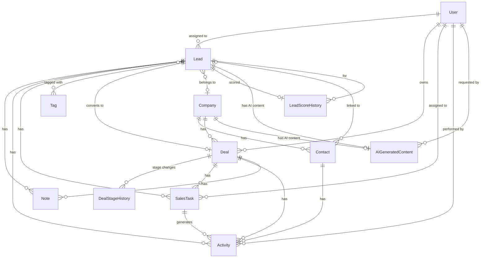

---

## 11. Domain Models

### Core Entities

```csharp
// === Base Classes ===

public abstract class BaseEntity
{
    public Guid Id { get; set; }
}

public abstract class AuditableEntity : BaseEntity
{
    public DateTime CreatedAt { get; set; }
    public string CreatedBy { get; set; }
    public DateTime? ModifiedAt { get; set; }
    public string? ModifiedBy { get; set; }
    public bool IsDeleted { get; set; }
    public DateTime? DeletedAt { get; set; }
}

// === Lead ===

public class Lead : AuditableEntity, IHasDomainEvents
{
    public string FirstName { get; set; }
    public string LastName { get; set; }
    public Email Email { get; set; }                    // Value Object
    public PhoneNumber? Phone { get; set; }              // Value Object
    public string? JobTitle { get; set; }
    public string? LinkedInUrl { get; set; }
    public LeadStatus Status { get; set; }
    public LeadSource Source { get; set; }
    public LeadScore? Score { get; set; }                // Value Object (Hot/Warm/Cold + reason)
    
    public Guid? CompanyId { get; set; }
    public Company? Company { get; set; }
    
    public Guid AssignedToId { get; set; }
    public User AssignedTo { get; set; }
    
    public ICollection<Note> Notes { get; set; }
    public ICollection<Activity> Activities { get; set; }
    public ICollection<Tag> Tags { get; set; }
    public ICollection<SalesTask> Tasks { get; set; }
    public ICollection<LeadScoreHistory> ScoreHistory { get; set; }
    
    public List<IDomainEvent> DomainEvents { get; } = new();
}

// === Company ===

public class Company : AuditableEntity
{
    public string Name { get; set; }
    public string? Domain { get; set; }                  // e.g., "acme.com"
    public string? Industry { get; set; }
    public string? Description { get; set; }
    public int? EmployeeCount { get; set; }
    public string? Website { get; set; }
    public string? Address { get; set; }
    
    public ICollection<Contact> Contacts { get; set; }
    public ICollection<Lead> Leads { get; set; }
    public ICollection<Deal> Deals { get; set; }
}

// === Contact ===

public class Contact : AuditableEntity
{
    public string FirstName { get; set; }
    public string LastName { get; set; }
    public Email Email { get; set; }
    public PhoneNumber? Phone { get; set; }
    public string? JobTitle { get; set; }
    public bool IsPrimary { get; set; }
    
    public Guid CompanyId { get; set; }
    public Company Company { get; set; }
    
    public ICollection<Activity> Activities { get; set; }
}

// === Deal ===

public class Deal : AuditableEntity, IHasDomainEvents
{
    public string Title { get; set; }
    public Money Value { get; set; }                     // Value Object (Amount + Currency)
    public DealStage Stage { get; set; }
    public int Probability { get; set; }                 // 0-100
    public DateTime? ExpectedCloseDate { get; set; }
    public DateTime? ActualCloseDate { get; set; }
    public string? LostReason { get; set; }
    
    public Guid? LeadId { get; set; }
    public Lead? Lead { get; set; }
    
    public Guid? CompanyId { get; set; }
    public Company? Company { get; set; }
    
    public Guid OwnerId { get; set; }
    public User Owner { get; set; }
    
    public ICollection<DealStageHistory> StageHistory { get; set; }
    public ICollection<SalesTask> Tasks { get; set; }
    public ICollection<Note> Notes { get; set; }
    public ICollection<Activity> Activities { get; set; }
    
    public List<IDomainEvent> DomainEvents { get; } = new();
}

// === SalesTask ===

public class SalesTask : AuditableEntity
{
    public string Title { get; set; }
    public string? Description { get; set; }
    public TaskType Type { get; set; }                   // Call, Meeting, FollowUp, Email, Other
    public TaskPriority Priority { get; set; }           // Low, Medium, High, Urgent
    public TaskStatus Status { get; set; }               // Pending, InProgress, Completed, Cancelled
    public DateTime DueDate { get; set; }
    public DateTime? CompletedAt { get; set; }
    public bool ReminderSent { get; set; }
    
    public Guid AssignedToId { get; set; }
    public User AssignedTo { get; set; }
    
    // Polymorphic association — task can be linked to Lead, Deal, or Contact
    public Guid? LeadId { get; set; }
    public Lead? Lead { get; set; }
    public Guid? DealId { get; set; }
    public Deal? Deal { get; set; }
    public Guid? ContactId { get; set; }
    public Contact? Contact { get; set; }
}

// === Value Objects ===

public record Email
{
    public string Value { get; }
    public Email(string value)
    {
        if (!IsValid(value)) throw new DomainException("Invalid email");
        Value = value.ToLowerInvariant();
    }
}

public record Money(decimal Amount, string Currency = "USD");

public record LeadScore(
    LeadScoreCategory Category,    // Hot, Warm, Cold
    int NumericScore,              // 0-100
    string Reasoning               // AI explanation
);
```

### Enums

```csharp
public enum LeadStatus
{
    New, Contacted, Qualified, Unqualified, Converted, Lost
}

public enum LeadSource
{
    Website, Referral, LinkedIn, ColdOutreach, Event, Advertisement, Other
}

public enum DealStage
{
    NewLead, Qualified, Proposal, Negotiation, Won, Lost
}

public enum TaskType
{
    Call, Meeting, FollowUp, Email, Demo, Other
}

public enum ActivityType
{
    Note, Call, Email, Meeting, StageChange, AIAction, TaskCompleted
}
```

---

## 12. API Design

### RESTful API Endpoints

All endpoints are prefixed with `/api/v1/`.

#### Authentication
| Method | Endpoint | Description |
|---|---|---|
| `POST` | `/auth/register` | Register new user |
| `POST` | `/auth/login` | Login, returns JWT + refresh token |
| `POST` | `/auth/refresh` | Refresh expired JWT |
| `POST` | `/auth/revoke` | Revoke refresh token (logout) |
| `GET` | `/auth/me` | Get current user profile |

#### Leads
| Method | Endpoint | Description |
|---|---|---|
| `GET` | `/leads` | List leads (paginated, filterable, sortable) |
| `GET` | `/leads/{id}` | Get lead detail with timeline |
| `POST` | `/leads` | Create lead |
| `PUT` | `/leads/{id}` | Update lead |
| `DELETE` | `/leads/{id}` | Soft-delete lead |
| `POST` | `/leads/import` | Import leads from CSV |
| `GET` | `/leads/{id}/timeline` | Get lead activity timeline |
| `POST` | `/leads/{id}/notes` | Add note to lead |
| `GET` | `/leads/duplicates` | Check for duplicates |

#### Companies
| Method | Endpoint | Description |
|---|---|---|
| `GET` | `/companies` | List companies |
| `GET` | `/companies/{id}` | Get company with contacts |
| `POST` | `/companies` | Create company |
| `PUT` | `/companies/{id}` | Update company |
| `DELETE` | `/companies/{id}` | Soft-delete company |

#### Contacts
| Method | Endpoint | Description |
|---|---|---|
| `GET` | `/contacts` | List contacts |
| `GET` | `/contacts/{id}` | Get contact detail |
| `POST` | `/contacts` | Create contact |
| `PUT` | `/contacts/{id}` | Update contact |
| `DELETE` | `/contacts/{id}` | Delete contact |

#### Deals (Pipeline)
| Method | Endpoint | Description |
|---|---|---|
| `GET` | `/deals` | List all deals |
| `GET` | `/deals/pipeline` | Get deals grouped by stage (for Kanban) |
| `GET` | `/deals/{id}` | Get deal detail |
| `POST` | `/deals` | Create deal |
| `PUT` | `/deals/{id}` | Update deal |
| `PATCH` | `/deals/{id}/stage` | Move deal to new stage |
| `DELETE` | `/deals/{id}` | Soft-delete deal |

#### Tasks
| Method | Endpoint | Description |
|---|---|---|
| `GET` | `/tasks` | List tasks (filterable by type, status, assignee) |
| `GET` | `/tasks/{id}` | Get task detail |
| `POST` | `/tasks` | Create task |
| `PUT` | `/tasks/{id}` | Update task |
| `PATCH` | `/tasks/{id}/complete` | Mark task complete |
| `DELETE` | `/tasks/{id}` | Delete task |
| `GET` | `/tasks/upcoming` | Get upcoming/overdue tasks |

#### Dashboard
| Method | Endpoint | Description |
|---|---|---|
| `GET` | `/dashboard/kpis` | Get KPI summary |
| `GET` | `/dashboard/pipeline-funnel` | Pipeline funnel data |
| `GET` | `/dashboard/lead-sources` | Lead source breakdown |
| `GET` | `/dashboard/revenue` | Revenue over time |
| `GET` | `/dashboard/recent-activity` | Recent activity feed |

#### Reports
| Method | Endpoint | Description |
|---|---|---|
| `GET` | `/reports/conversion` | Conversion rate report |
| `GET` | `/reports/performance` | Sales rep performance |
| `GET` | `/reports/revenue` | Revenue report |
| `GET` | `/reports/lead-sources` | Lead source analysis |

#### AI
| Method | Endpoint | Description |
|---|---|---|
| `POST` | `/ai/score-lead/{leadId}` | Score a lead with AI |
| `POST` | `/ai/research-company` | Research a company |
| `POST` | `/ai/generate-email` | Generate personalized email |
| `POST` | `/ai/summarize-meeting` | Summarize meeting notes |
| `POST` | `/ai/sales-playbook/{leadId}` | Generate playbook for lead |

### API Response Format

```json
// Success
{
  "succeeded": true,
  "data": { ... },
  "message": null,
  "errors": []
}

// Success (paginated)
{
  "succeeded": true,
  "data": {
    "items": [...],
    "pageNumber": 1,
    "totalPages": 5,
    "totalCount": 47,
    "hasPreviousPage": false,
    "hasNextPage": true
  }
}

// Error
{
  "succeeded": false,
  "data": null,
  "message": "Validation failed",
  "errors": [
    { "field": "email", "message": "Email is required" }
  ]
}
```

### API Versioning Strategy

- URL-based versioning: `/api/v1/...`
- Keeps backward compatibility when v2 is introduced
- `Asp.Versioning.Http` NuGet package

---

## 13. Authentication Flow

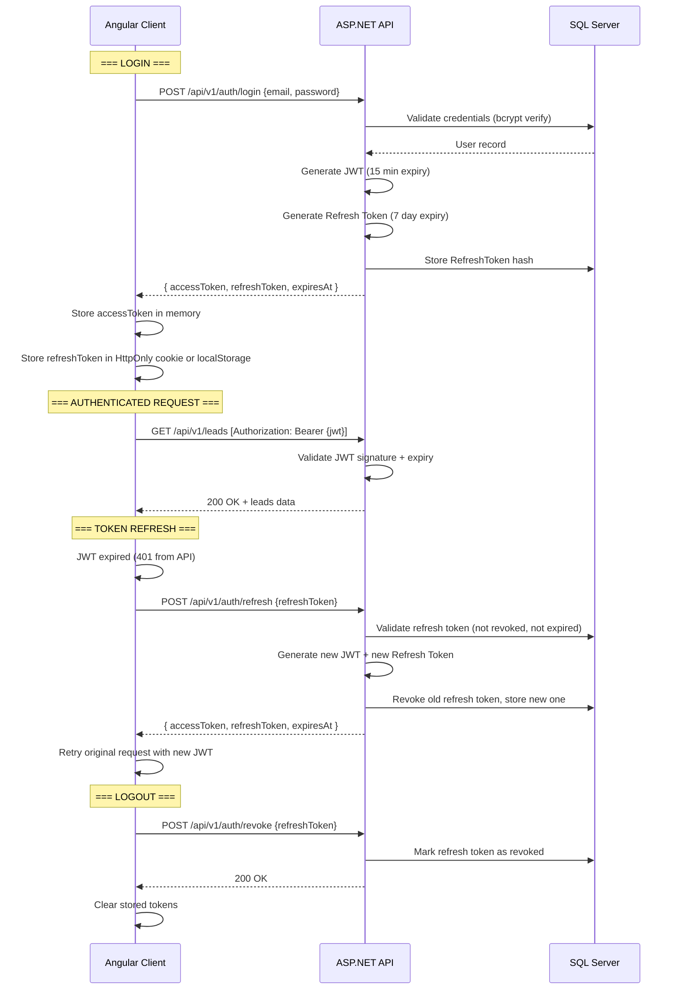

### JWT Configuration

| Parameter | Value | Rationale |
|---|---|---|
| Access Token Lifetime | 15 minutes | Short-lived to minimize damage from token theft |
| Refresh Token Lifetime | 7 days | Balances UX (no constant re-login) with security |
| Signing Algorithm | HMAC-SHA256 | Sufficient for single-service architecture |
| Token Storage (Frontend) | Access token in memory; Refresh token in `localStorage` with rotation | HttpOnly cookie is ideal but complicates Angular SPA CORS setup for MVP |

### JWT Claims

```json
{
  "sub": "user-guid",
  "email": "omar@example.com",
  "given_name": "Omar",
  "family_name": "Ahmed",
  "role": "Admin",
  "iat": 1753084800,
  "exp": 1753085700
}
```

---

## 14. Authorization Strategy

### Role-Based Access Control (RBAC)

| Role | Permissions |
|---|---|
| **Admin** | Full access. Manage users, settings, all data |
| **Manager** | View all team data. Manage own team's leads/deals. View all reports |
| **Sales Rep** | CRUD own leads/deals/tasks. View own reports. Use AI features |

### Implementation

```csharp
// Controller-level authorization
[Authorize(Roles = "Admin,Manager")]
[HttpGet("reports/team-performance")]
public async Task<IActionResult> GetTeamPerformance() { ... }

// Handler-level authorization (for more complex rules)
public class UpdateLeadCommandHandler : IRequestHandler<UpdateLeadCommand, Result<LeadDto>>
{
    public async Task<Result<LeadDto>> Handle(UpdateLeadCommand request, CancellationToken ct)
    {
        var lead = await _context.Leads.FindAsync(request.LeadId);
        
        // Sales Reps can only edit their own leads
        if (_currentUser.Role == "SalesRep" && lead.AssignedToId != _currentUser.Id)
            return Result<LeadDto>.Forbidden("You can only edit your own leads");
        
        // ... proceed with update
    }
}
```

### Future-Ready: Policy-Based Authorization

```csharp
// Ready for tenant isolation in Phase 2
services.AddAuthorization(options =>
{
    options.AddPolicy("SameTenant", policy =>
        policy.RequireAssertion(context => /* tenant check */));
});
```

---

## 15. AI Architecture

### Design Philosophy

> AI is NOT a chatbot sitting in a sidebar. AI is woven into every business workflow as an invisible co-worker that enriches data, suggests actions, and automates grunt work.

### AI Integration Points

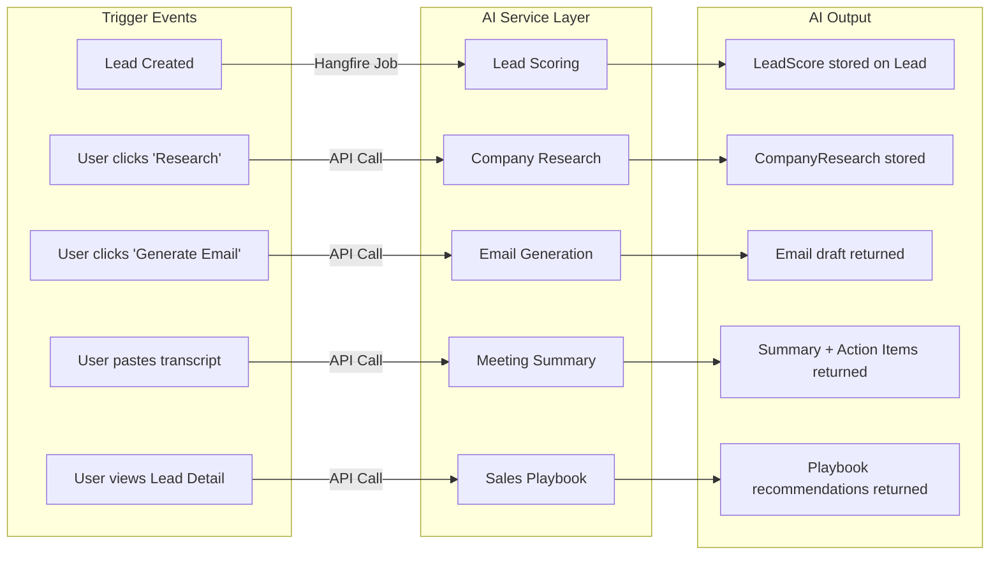

### AI Service Abstraction

```csharp
public interface IAIService
{
    Task<LeadScoreResult> ScoreLeadAsync(LeadScoringContext context, CancellationToken ct);
    Task<CompanyResearchResult> ResearchCompanyAsync(CompanyResearchContext context, CancellationToken ct);
    Task<GeneratedEmail> GenerateEmailAsync(EmailGenerationContext context, CancellationToken ct);
    Task<MeetingSummary> SummarizeMeetingAsync(MeetingSummaryContext context, CancellationToken ct);
    Task<SalesPlaybook> GeneratePlaybookAsync(PlaybookContext context, CancellationToken ct);
}
```

> [!IMPORTANT]
> **Why abstract behind `IAIService`?**
> - Swap providers (OpenAI → Azure OpenAI → Anthropic → local model) without touching business logic
> - Mock AI responses in tests
> - Add fallback strategies (if OpenAI is down, use cached/default scoring)

### AI Provider Strategy

| Consideration | Decision |
|---|---|
| **Primary Provider** | OpenAI API (GPT-4o-mini for most tasks, GPT-4o for complex analysis) |
| **Model Selection** | GPT-4o-mini for scoring, email gen, playbook (fast, cheap). GPT-4o for company research and meeting summary (needs deeper reasoning) |
| **Fallback** | Graceful degradation — if AI fails, feature still works (manual scoring, no research, etc.) |
| **Cost Control** | Token usage logged per request. Model selection optimized by task complexity |
| **Response Format** | JSON mode enforced via system prompt + response_format parameter |

### Resilience

```csharp
// Polly retry policy for AI calls
services.AddHttpClient<IAIService, AIService>()
    .AddTransientHttpErrorPolicy(p => p.WaitAndRetryAsync(
        retryCount: 3,
        sleepDurationProvider: attempt => TimeSpan.FromSeconds(Math.Pow(2, attempt)),
        onRetry: (outcome, timespan, retryAttempt, context) =>
        {
            logger.LogWarning("AI API retry {Attempt} after {Delay}s", retryAttempt, timespan.TotalSeconds);
        }
    ))
    .AddTransientHttpErrorPolicy(p => p.CircuitBreakerAsync(
        handledEventsAllowedBeforeBreaking: 5,
        durationOfBreak: TimeSpan.FromMinutes(1)
    ));
```

---

## 16. Prompt Architecture

### Prompt Design Principles

1. **Prompts are code** — versioned, tested, maintained like any other business logic
2. **Structured output** — every prompt enforces JSON output schema
3. **Context-rich** — prompts include all relevant business context
4. **Explainable** — every AI decision includes a human-readable explanation

### Prompt Templates

#### Lead Scoring Prompt

```
System:
You are an expert B2B sales analyst. Score the following lead based on their
likelihood to convert into a paying customer.

Consider these factors:
- Job title and seniority (decision-maker vs. individual contributor)
- Company size and industry fit
- Lead source quality
- Engagement signals (notes, activities)
- Communication recency

Respond in this exact JSON format:
{
  "category": "Hot" | "Warm" | "Cold",
  "numericScore": <0-100>,
  "reasoning": "<2-3 sentence explanation of WHY this score was given>",
  "factors": [
    { "factor": "<factor name>", "impact": "positive" | "negative", "detail": "<why>" }
  ],
  "recommendedAction": "<specific next action>"
}

User:
Lead: {{FirstName}} {{LastName}}
Email: {{Email}}
Job Title: {{JobTitle}}
Company: {{CompanyName}} ({{Industry}}, {{EmployeeCount}} employees)
Lead Source: {{Source}}
Status: {{Status}}
Created: {{CreatedAt}}
Last Activity: {{LastActivityDate}}
Notes: {{RecentNotes}}
Activities: {{RecentActivities}}
```

#### Company Research Prompt

```
System:
You are a sales intelligence analyst. Research the following company and provide
actionable intelligence for a B2B sales team.

Respond in this exact JSON format:
{
  "companySummary": "<2-3 paragraph company overview>",
  "industry": "<primary industry>",
  "estimatedSize": "<startup / SMB / mid-market / enterprise>",
  "painPoints": [
    { "pain": "<pain point>", "evidence": "<why you think this>" }
  ],
  "potentialNeeds": ["<need 1>", "<need 2>", ...],
  "suggestedPitch": "<personalized 2-3 sentence elevator pitch>",
  "talkingPoints": ["<point 1>", "<point 2>", ...],
  "competitorsToWatch": ["<competitor 1>", ...]
}

User:
Company: {{CompanyName}}
Website: {{Website}}
Description: {{Description}}
Industry (if known): {{Industry}}
Our Product/Service: {{OurProductDescription}}
```

#### Personalized Email Prompt

```
System:
You are a world-class SDR email copywriter. Write a personalized cold outreach
email that feels genuine, specific, and value-driven — NOT generic or spammy.

Rules:
- Keep subject line under 50 characters
- Keep body under 150 words
- Include exactly ONE clear call-to-action
- Reference something specific about their company/role
- Never use phrases like "I hope this email finds you well"
- Tone: {{Tone}} (professional / casual / direct / friendly)

Respond in this exact JSON format:
{
  "subjectLine": "<subject>",
  "body": "<email body with line breaks>",
  "callToAction": "<the specific CTA>",
  "personalizationNotes": "<what was personalized and why>"
}

User:
Recipient: {{FirstName}} {{LastName}}, {{JobTitle}} at {{CompanyName}}
Industry: {{Industry}}
Company Pain Points: {{PainPoints}}
Our Product: {{ProductName}} — {{ProductDescription}}
Tone: {{Tone}}
Goal: {{EmailGoal}}
```

#### Meeting Summary Prompt

```
System:
You are a senior sales operations analyst. Analyze the following meeting
transcript/notes and extract actionable insights.

Respond in this exact JSON format:
{
  "summary": "<3-5 sentence executive summary>",
  "keyDiscussionPoints": ["<point 1>", ...],
  "actionItems": [
    { "action": "<what>", "owner": "<who>", "deadline": "<when or 'ASAP'>" }
  ],
  "customerObjections": [
    { "objection": "<what they said>", "suggestedResponse": "<how to handle>" }
  ],
  "risks": [
    { "risk": "<risk>", "severity": "low" | "medium" | "high", "mitigation": "<suggestion>" }
  ],
  "nextSteps": ["<step 1>", "<step 2>", ...],
  "sentiment": "positive" | "neutral" | "negative",
  "dealImpact": "<how this meeting affects the deal>"
}

User:
Meeting Date: {{MeetingDate}}
Attendees: {{Attendees}}
Deal Context: {{DealTitle}} — Stage: {{DealStage}}, Value: {{DealValue}}
Transcript/Notes:
{{TranscriptOrNotes}}
```

#### Sales Playbook Prompt

```
System:
You are a senior sales strategist. Based on the lead profile and all available
context, generate a tactical sales playbook — specific, actionable advice that a
sales rep can execute immediately.

Respond in this exact JSON format:
{
  "bestChannel": {
    "channel": "email" | "phone" | "linkedin" | "in-person",
    "reasoning": "<why this channel>"
  },
  "bestTimeToContact": {
    "dayOfWeek": "<best day>",
    "timeRange": "<e.g., 10am-12pm local time>",
    "reasoning": "<why>"
  },
  "salesApproach": {
    "strategy": "<consultative / challenger / solution-selling / etc.>",
    "reasoning": "<why this approach for this lead>",
    "openingLine": "<suggested conversation opener>"
  },
  "expectedObjections": [
    { "objection": "<likely pushback>", "response": "<how to handle it>" }
  ],
  "suggestedNextActions": [
    { "action": "<specific action>", "priority": "high" | "medium" | "low", "timing": "<when>" }
  ],
  "competitivePositioning": "<how to differentiate against likely competitors>"
}

User:
Lead: {{FirstName}} {{LastName}}, {{JobTitle}}
Company: {{CompanyName}} ({{Industry}}, {{EmployeeCount}} employees)
Lead Score: {{ScoreCategory}} ({{NumericScore}}/100)
Status: {{Status}}
Source: {{Source}}
Recent Activities: {{Activities}}
Notes: {{Notes}}
Company Research: {{CompanyResearch}}
```

### Prompt Management Architecture

```
Infrastructure/AI/
├── Prompts/
│   ├── IPromptTemplate.cs          # Interface for all prompts
│   ├── BasePromptTemplate.cs       # Shared rendering logic (Scriban/Handlebars)
│   ├── LeadScoringPrompt.cs
│   ├── CompanyResearchPrompt.cs
│   ├── EmailGeneratorPrompt.cs
│   ├── MeetingSummaryPrompt.cs
│   └── SalesPlaybookPrompt.cs
├── AIService.cs                    # Orchestrates prompt → API call → parse response
└── PromptBuilder.cs                # Renders templates with context data
```

> [!TIP]
> **Why not store prompts in the database?**
> For MVP, prompts-as-code is simpler, testable, and versioned with Git. For Phase 2, move to a prompt registry table for runtime A/B testing.

---

## 17. Background Job Architecture

### Hangfire Configuration

| Setting | Value | Rationale |
|---|---|---|
| **Storage** | SQL Server (same DB) | Single dependency for MVP |
| **Dashboard** | Enabled (Admin role only) | `/hangfire` with auth |
| **Queues** | `critical`, `default`, `ai`, `notifications` | Workload isolation |
| **Retry Policy** | 3 retries with exponential backoff | Reasonable for AI API calls |
| **Worker Count** | 5 (configurable via appsettings) | Prevents overwhelming AI API |

### Job Types

| Job | Type | Trigger | Queue |
|---|---|---|---|
| `LeadScoringJob` | Fire-and-forget | Lead created/updated | `ai` |
| `AutomationWorkflowJob` | Fire-and-forget | Domain events | `default` |
| `FollowUpReminderJob` | Recurring (daily at 8 AM) | Cron schedule | `notifications` |
| `TaskDueDateReminderJob` | Recurring (every 2 hours) | Cron schedule | `notifications` |
| `StaleLeadDetectionJob` | Recurring (daily) | Cron schedule | `default` |
| `WeeklyReportJob` | Recurring (Monday 9 AM) | Cron schedule (Phase 2) | `default` |
| `DataCleanupJob` | Recurring (weekly) | Cron schedule | `default` |

### Job Architecture

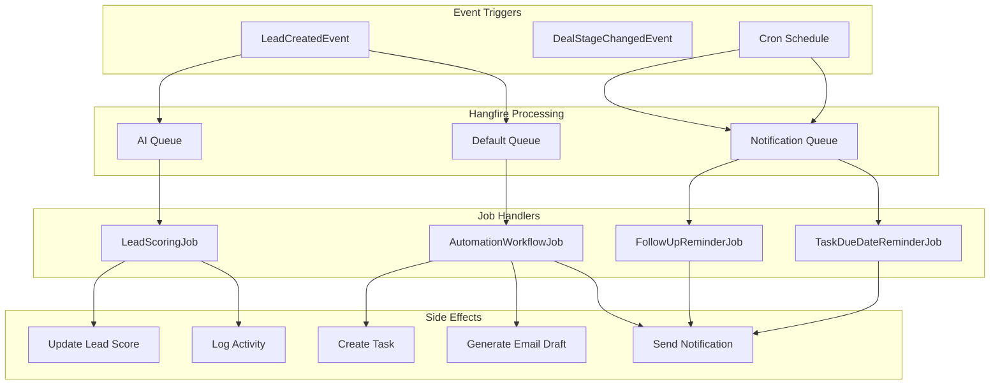

---

## 18. Automation Flow Design

### Core Automation: Lead Created Workflow

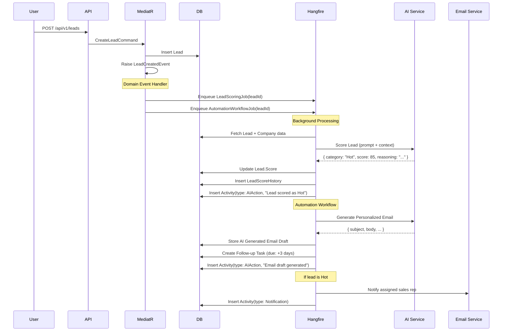

### Follow-Up Automation

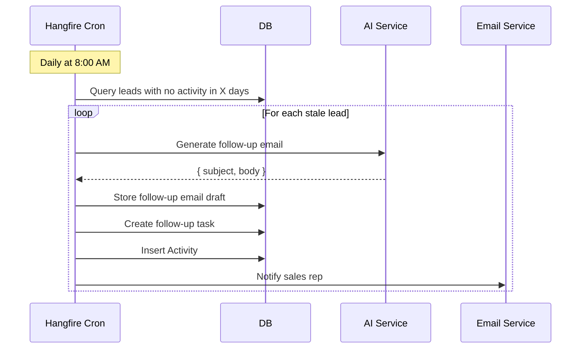

### Meeting Summary Automation

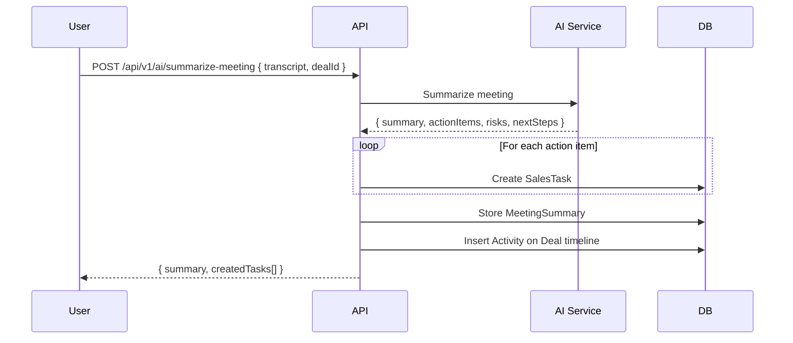

---

## 19. Sequence Diagrams

### Full Page Load: Dashboard

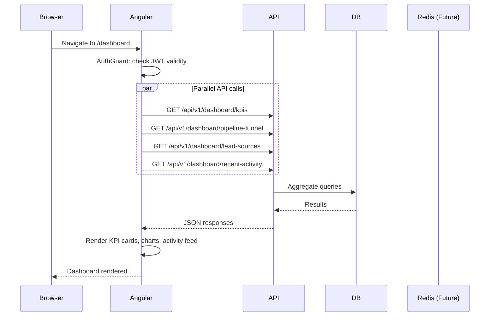

### Kanban Drag & Drop

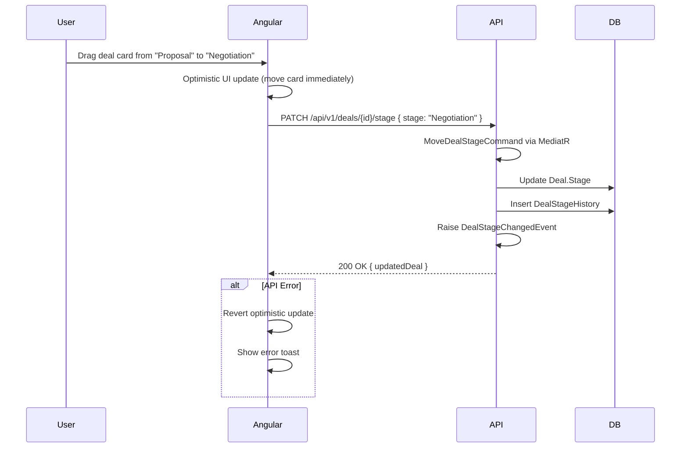

---

## 20. Database Schema

### Complete SQL Schema

```sql
-- ============================================
-- USERS & AUTHENTICATION
-- ============================================

CREATE TABLE Users (
    Id              UNIQUEIDENTIFIER PRIMARY KEY DEFAULT NEWSEQUENTIALID(),
    Email           NVARCHAR(256) NOT NULL,
    PasswordHash    NVARCHAR(500) NOT NULL,
    FirstName       NVARCHAR(100) NOT NULL,
    LastName        NVARCHAR(100) NOT NULL,
    Role            NVARCHAR(50) NOT NULL DEFAULT 'SalesRep',  -- Admin, Manager, SalesRep
    AvatarUrl       NVARCHAR(500),
    IsActive        BIT NOT NULL DEFAULT 1,
    LastLoginAt     DATETIME2,
    CreatedAt       DATETIME2 NOT NULL DEFAULT GETUTCDATE(),
    ModifiedAt      DATETIME2,

    CONSTRAINT UQ_Users_Email UNIQUE (Email)
);

CREATE TABLE RefreshTokens (
    Id              UNIQUEIDENTIFIER PRIMARY KEY DEFAULT NEWSEQUENTIALID(),
    UserId          UNIQUEIDENTIFIER NOT NULL,
    Token           NVARCHAR(500) NOT NULL,
    ExpiresAt       DATETIME2 NOT NULL,
    CreatedAt       DATETIME2 NOT NULL DEFAULT GETUTCDATE(),
    RevokedAt       DATETIME2,
    ReplacedByToken NVARCHAR(500),

    CONSTRAINT FK_RefreshTokens_Users FOREIGN KEY (UserId) REFERENCES Users(Id)
);

CREATE INDEX IX_RefreshTokens_UserId ON RefreshTokens(UserId);
CREATE INDEX IX_RefreshTokens_Token ON RefreshTokens(Token);

-- ============================================
-- COMPANIES
-- ============================================

CREATE TABLE Companies (
    Id              UNIQUEIDENTIFIER PRIMARY KEY DEFAULT NEWSEQUENTIALID(),
    Name            NVARCHAR(300) NOT NULL,
    Domain          NVARCHAR(300),
    Industry        NVARCHAR(200),
    Description     NVARCHAR(MAX),
    EmployeeCount   INT,
    Website         NVARCHAR(500),
    Address         NVARCHAR(500),
    City            NVARCHAR(200),
    Country         NVARCHAR(200),
    CreatedAt       DATETIME2 NOT NULL DEFAULT GETUTCDATE(),
    CreatedBy       NVARCHAR(256),
    ModifiedAt      DATETIME2,
    ModifiedBy      NVARCHAR(256),
    IsDeleted       BIT NOT NULL DEFAULT 0,
    DeletedAt       DATETIME2
);

CREATE INDEX IX_Companies_Name ON Companies(Name);
CREATE INDEX IX_Companies_Domain ON Companies(Domain);
CREATE INDEX IX_Companies_IsDeleted ON Companies(IsDeleted);

-- ============================================
-- CONTACTS
-- ============================================

CREATE TABLE Contacts (
    Id              UNIQUEIDENTIFIER PRIMARY KEY DEFAULT NEWSEQUENTIALID(),
    FirstName       NVARCHAR(100) NOT NULL,
    LastName        NVARCHAR(100) NOT NULL,
    Email           NVARCHAR(256),
    Phone           NVARCHAR(50),
    JobTitle        NVARCHAR(200),
    IsPrimary       BIT NOT NULL DEFAULT 0,
    CompanyId       UNIQUEIDENTIFIER NOT NULL,
    CreatedAt       DATETIME2 NOT NULL DEFAULT GETUTCDATE(),
    CreatedBy       NVARCHAR(256),
    ModifiedAt      DATETIME2,
    ModifiedBy      NVARCHAR(256),
    IsDeleted       BIT NOT NULL DEFAULT 0,
    DeletedAt       DATETIME2,

    CONSTRAINT FK_Contacts_Companies FOREIGN KEY (CompanyId) REFERENCES Companies(Id)
);

CREATE INDEX IX_Contacts_CompanyId ON Contacts(CompanyId);
CREATE INDEX IX_Contacts_Email ON Contacts(Email);

-- ============================================
-- LEADS
-- ============================================

CREATE TABLE Leads (
    Id              UNIQUEIDENTIFIER PRIMARY KEY DEFAULT NEWSEQUENTIALID(),
    FirstName       NVARCHAR(100) NOT NULL,
    LastName        NVARCHAR(100) NOT NULL,
    Email           NVARCHAR(256) NOT NULL,
    Phone           NVARCHAR(50),
    JobTitle        NVARCHAR(200),
    LinkedInUrl     NVARCHAR(500),
    Status          NVARCHAR(50) NOT NULL DEFAULT 'New',
    Source          NVARCHAR(50) NOT NULL DEFAULT 'Other',
    ScoreCategory   NVARCHAR(20),          -- Hot, Warm, Cold
    ScoreNumeric    INT,                    -- 0-100
    ScoreReasoning  NVARCHAR(MAX),          -- AI explanation
    CompanyId       UNIQUEIDENTIFIER,
    AssignedToId    UNIQUEIDENTIFIER NOT NULL,
    ContactId       UNIQUEIDENTIFIER,
    CreatedAt       DATETIME2 NOT NULL DEFAULT GETUTCDATE(),
    CreatedBy       NVARCHAR(256),
    ModifiedAt      DATETIME2,
    ModifiedBy      NVARCHAR(256),
    IsDeleted       BIT NOT NULL DEFAULT 0,
    DeletedAt       DATETIME2,

    CONSTRAINT FK_Leads_Companies FOREIGN KEY (CompanyId) REFERENCES Companies(Id),
    CONSTRAINT FK_Leads_Users FOREIGN KEY (AssignedToId) REFERENCES Users(Id),
    CONSTRAINT FK_Leads_Contacts FOREIGN KEY (ContactId) REFERENCES Contacts(Id)
);

CREATE INDEX IX_Leads_Email ON Leads(Email);
CREATE INDEX IX_Leads_Status ON Leads(Status);
CREATE INDEX IX_Leads_AssignedToId ON Leads(AssignedToId);
CREATE INDEX IX_Leads_CompanyId ON Leads(CompanyId);
CREATE INDEX IX_Leads_ScoreCategory ON Leads(ScoreCategory);
CREATE INDEX IX_Leads_IsDeleted ON Leads(IsDeleted);
CREATE INDEX IX_Leads_CreatedAt ON Leads(CreatedAt);

-- ============================================
-- TAGS (Many-to-Many with Leads)
-- ============================================

CREATE TABLE Tags (
    Id              UNIQUEIDENTIFIER PRIMARY KEY DEFAULT NEWSEQUENTIALID(),
    Name            NVARCHAR(100) NOT NULL,
    Color           NVARCHAR(7),            -- Hex color, e.g., #FF5733
    CreatedAt       DATETIME2 NOT NULL DEFAULT GETUTCDATE(),

    CONSTRAINT UQ_Tags_Name UNIQUE (Name)
);

CREATE TABLE LeadTags (
    LeadId          UNIQUEIDENTIFIER NOT NULL,
    TagId           UNIQUEIDENTIFIER NOT NULL,

    CONSTRAINT PK_LeadTags PRIMARY KEY (LeadId, TagId),
    CONSTRAINT FK_LeadTags_Leads FOREIGN KEY (LeadId) REFERENCES Leads(Id),
    CONSTRAINT FK_LeadTags_Tags FOREIGN KEY (TagId) REFERENCES Tags(Id)
);

-- ============================================
-- DEALS (Sales Pipeline)
-- ============================================

CREATE TABLE Deals (
    Id                  UNIQUEIDENTIFIER PRIMARY KEY DEFAULT NEWSEQUENTIALID(),
    Title               NVARCHAR(300) NOT NULL,
    Value               DECIMAL(18,2) NOT NULL DEFAULT 0,
    Currency            NVARCHAR(3) NOT NULL DEFAULT 'USD',
    Stage               NVARCHAR(50) NOT NULL DEFAULT 'NewLead',
    Probability         INT NOT NULL DEFAULT 0,
    ExpectedCloseDate   DATETIME2,
    ActualCloseDate     DATETIME2,
    LostReason          NVARCHAR(500),
    LeadId              UNIQUEIDENTIFIER,
    CompanyId           UNIQUEIDENTIFIER,
    OwnerId             UNIQUEIDENTIFIER NOT NULL,
    CreatedAt           DATETIME2 NOT NULL DEFAULT GETUTCDATE(),
    CreatedBy           NVARCHAR(256),
    ModifiedAt          DATETIME2,
    ModifiedBy          NVARCHAR(256),
    IsDeleted           BIT NOT NULL DEFAULT 0,
    DeletedAt           DATETIME2,

    CONSTRAINT FK_Deals_Leads FOREIGN KEY (LeadId) REFERENCES Leads(Id),
    CONSTRAINT FK_Deals_Companies FOREIGN KEY (CompanyId) REFERENCES Companies(Id),
    CONSTRAINT FK_Deals_Users FOREIGN KEY (OwnerId) REFERENCES Users(Id)
);

CREATE INDEX IX_Deals_Stage ON Deals(Stage);
CREATE INDEX IX_Deals_OwnerId ON Deals(OwnerId);
CREATE INDEX IX_Deals_IsDeleted ON Deals(IsDeleted);

-- ============================================
-- DEAL STAGE HISTORY (for analytics)
-- ============================================

CREATE TABLE DealStageHistory (
    Id              UNIQUEIDENTIFIER PRIMARY KEY DEFAULT NEWSEQUENTIALID(),
    DealId          UNIQUEIDENTIFIER NOT NULL,
    FromStage       NVARCHAR(50),
    ToStage         NVARCHAR(50) NOT NULL,
    ChangedAt       DATETIME2 NOT NULL DEFAULT GETUTCDATE(),
    ChangedBy       NVARCHAR(256),

    CONSTRAINT FK_DealStageHistory_Deals FOREIGN KEY (DealId) REFERENCES Deals(Id)
);

CREATE INDEX IX_DealStageHistory_DealId ON DealStageHistory(DealId);

-- ============================================
-- SALES TASKS
-- ============================================

CREATE TABLE SalesTasks (
    Id              UNIQUEIDENTIFIER PRIMARY KEY DEFAULT NEWSEQUENTIALID(),
    Title           NVARCHAR(300) NOT NULL,
    Description     NVARCHAR(MAX),
    Type            NVARCHAR(50) NOT NULL,    -- Call, Meeting, FollowUp, Email, Demo, Other
    Priority        NVARCHAR(50) NOT NULL DEFAULT 'Medium',
    Status          NVARCHAR(50) NOT NULL DEFAULT 'Pending',
    DueDate         DATETIME2 NOT NULL,
    CompletedAt     DATETIME2,
    ReminderSent    BIT NOT NULL DEFAULT 0,
    AssignedToId    UNIQUEIDENTIFIER NOT NULL,
    LeadId          UNIQUEIDENTIFIER,
    DealId          UNIQUEIDENTIFIER,
    ContactId       UNIQUEIDENTIFIER,
    CreatedAt       DATETIME2 NOT NULL DEFAULT GETUTCDATE(),
    CreatedBy       NVARCHAR(256),
    ModifiedAt      DATETIME2,
    ModifiedBy      NVARCHAR(256),

    CONSTRAINT FK_SalesTasks_Users FOREIGN KEY (AssignedToId) REFERENCES Users(Id),
    CONSTRAINT FK_SalesTasks_Leads FOREIGN KEY (LeadId) REFERENCES Leads(Id),
    CONSTRAINT FK_SalesTasks_Deals FOREIGN KEY (DealId) REFERENCES Deals(Id),
    CONSTRAINT FK_SalesTasks_Contacts FOREIGN KEY (ContactId) REFERENCES Contacts(Id)
);

CREATE INDEX IX_SalesTasks_AssignedToId ON SalesTasks(AssignedToId);
CREATE INDEX IX_SalesTasks_DueDate ON SalesTasks(DueDate);
CREATE INDEX IX_SalesTasks_Status ON SalesTasks(Status);

-- ============================================
-- ACTIVITIES (Timeline Events)
-- ============================================

CREATE TABLE Activities (
    Id              UNIQUEIDENTIFIER PRIMARY KEY DEFAULT NEWSEQUENTIALID(),
    Type            NVARCHAR(50) NOT NULL,    -- Note, Call, Email, Meeting, StageChange, AIAction, TaskCompleted
    Title           NVARCHAR(300) NOT NULL,
    Description     NVARCHAR(MAX),
    PerformedById   UNIQUEIDENTIFIER,
    LeadId          UNIQUEIDENTIFIER,
    DealId          UNIQUEIDENTIFIER,
    ContactId       UNIQUEIDENTIFIER,
    CreatedAt       DATETIME2 NOT NULL DEFAULT GETUTCDATE(),

    CONSTRAINT FK_Activities_Users FOREIGN KEY (PerformedById) REFERENCES Users(Id),
    CONSTRAINT FK_Activities_Leads FOREIGN KEY (LeadId) REFERENCES Leads(Id),
    CONSTRAINT FK_Activities_Deals FOREIGN KEY (DealId) REFERENCES Deals(Id),
    CONSTRAINT FK_Activities_Contacts FOREIGN KEY (ContactId) REFERENCES Contacts(Id)
);

CREATE INDEX IX_Activities_LeadId ON Activities(LeadId);
CREATE INDEX IX_Activities_DealId ON Activities(DealId);
CREATE INDEX IX_Activities_ContactId ON Activities(ContactId);
CREATE INDEX IX_Activities_CreatedAt ON Activities(CreatedAt DESC);

-- ============================================
-- NOTES
-- ============================================

CREATE TABLE Notes (
    Id              UNIQUEIDENTIFIER PRIMARY KEY DEFAULT NEWSEQUENTIALID(),
    Content         NVARCHAR(MAX) NOT NULL,
    LeadId          UNIQUEIDENTIFIER,
    DealId          UNIQUEIDENTIFIER,
    AuthorId        UNIQUEIDENTIFIER NOT NULL,
    CreatedAt       DATETIME2 NOT NULL DEFAULT GETUTCDATE(),
    ModifiedAt      DATETIME2,

    CONSTRAINT FK_Notes_Leads FOREIGN KEY (LeadId) REFERENCES Leads(Id),
    CONSTRAINT FK_Notes_Deals FOREIGN KEY (DealId) REFERENCES Deals(Id),
    CONSTRAINT FK_Notes_Users FOREIGN KEY (AuthorId) REFERENCES Users(Id)
);

CREATE INDEX IX_Notes_LeadId ON Notes(LeadId);
CREATE INDEX IX_Notes_DealId ON Notes(DealId);

-- ============================================
-- LEAD SCORE HISTORY
-- ============================================

CREATE TABLE LeadScoreHistory (
    Id              UNIQUEIDENTIFIER PRIMARY KEY DEFAULT NEWSEQUENTIALID(),
    LeadId          UNIQUEIDENTIFIER NOT NULL,
    Category        NVARCHAR(20) NOT NULL,
    NumericScore    INT NOT NULL,
    Reasoning       NVARCHAR(MAX),
    FactorsJson     NVARCHAR(MAX),           -- JSON array of scoring factors
    ScoredAt        DATETIME2 NOT NULL DEFAULT GETUTCDATE(),
    Model           NVARCHAR(100),           -- AI model used

    CONSTRAINT FK_LeadScoreHistory_Leads FOREIGN KEY (LeadId) REFERENCES Leads(Id)
);

CREATE INDEX IX_LeadScoreHistory_LeadId ON LeadScoreHistory(LeadId);

-- ============================================
-- AI GENERATED CONTENT
-- ============================================

CREATE TABLE AIGeneratedContent (
    Id              UNIQUEIDENTIFIER PRIMARY KEY DEFAULT NEWSEQUENTIALID(),
    Type            NVARCHAR(50) NOT NULL,    -- CompanyResearch, Email, MeetingSummary, Playbook
    ContentJson     NVARCHAR(MAX) NOT NULL,   -- Full AI response stored as JSON
    PromptTokens    INT,
    CompletionTokens INT,
    Model           NVARCHAR(100),
    LeadId          UNIQUEIDENTIFIER,
    DealId          UNIQUEIDENTIFIER,
    CompanyId       UNIQUEIDENTIFIER,
    RequestedById   UNIQUEIDENTIFIER NOT NULL,
    CreatedAt       DATETIME2 NOT NULL DEFAULT GETUTCDATE(),

    CONSTRAINT FK_AIContent_Leads FOREIGN KEY (LeadId) REFERENCES Leads(Id),
    CONSTRAINT FK_AIContent_Deals FOREIGN KEY (DealId) REFERENCES Deals(Id),
    CONSTRAINT FK_AIContent_Companies FOREIGN KEY (CompanyId) REFERENCES Companies(Id),
    CONSTRAINT FK_AIContent_Users FOREIGN KEY (RequestedById) REFERENCES Users(Id)
);

CREATE INDEX IX_AIContent_LeadId ON AIGeneratedContent(LeadId);
CREATE INDEX IX_AIContent_Type ON AIGeneratedContent(Type);

-- ============================================
-- AUTOMATION LOG
-- ============================================

CREATE TABLE AutomationLogs (
    Id              UNIQUEIDENTIFIER PRIMARY KEY DEFAULT NEWSEQUENTIALID(),
    WorkflowName    NVARCHAR(200) NOT NULL,
    TriggerEvent    NVARCHAR(200) NOT NULL,
    Status          NVARCHAR(50) NOT NULL,    -- Started, Completed, Failed
    StepsCompleted  INT NOT NULL DEFAULT 0,
    TotalSteps      INT NOT NULL DEFAULT 0,
    ErrorMessage    NVARCHAR(MAX),
    EntityId        UNIQUEIDENTIFIER,
    EntityType      NVARCHAR(100),
    StartedAt       DATETIME2 NOT NULL DEFAULT GETUTCDATE(),
    CompletedAt     DATETIME2,
    ExecutionTimeMs INT
);

CREATE INDEX IX_AutomationLogs_WorkflowName ON AutomationLogs(WorkflowName);
CREATE INDEX IX_AutomationLogs_Status ON AutomationLogs(Status);
```

---

## 21. Development Phases

### Phase Breakdown

| Phase | Duration | Focus | Key Deliverables |
|---|---|---|---|
| **Phase 0: Foundation** | Day 1 (4h) | Project setup, architecture scaffolding | Solution structure, DB schema, Docker, base entities, DI config |
| **Phase 1: Core Backend** | Day 2 (8h) | Auth + Lead + Company + Contact CRUD | JWT auth flow, all CRUD endpoints, validation, error handling |
| **Phase 2: Pipeline & Tasks** | Day 3 (8h) | Deals pipeline + Tasks + Dashboard queries | Kanban API, task management, dashboard KPIs, reporting queries |
| **Phase 3: AI Integration** | Day 4 (8h) | All AI features | Lead scoring, company research, email gen, meeting summary, playbook |
| **Phase 4: Automation** | Day 4-5 (4h) | Background jobs + automation workflows | Hangfire setup, lead-created workflow, follow-up automation |
| **Phase 5: Frontend Core** | Day 5-6 (12h) | Angular app shell + Auth + Dashboard + Leads | Login/register, dashboard with charts, lead management UI |
| **Phase 6: Frontend Advanced** | Day 6-7 (12h) | Pipeline Kanban + Tasks + AI pages + Reports | Kanban drag-drop, AI feature UIs, report visualizations |
| **Phase 7: Polish** | Day 7 (4h) | Integration testing, bug fixes, deployment | Docker compose, README, final QA |

---

## 22. Sprint Plan

Given the ~1 week timeframe, this is organized as a single sprint with daily milestones.

### Day 1 — Foundation & Scaffolding

| Task | Estimate | Priority |
|---|---|---|
| Create .NET solution with all projects | 30 min | P0 |
| Configure `Directory.Build.props` (shared package versions) | 15 min | P0 |
| Set up Docker Compose (SQL Server + app) | 30 min | P0 |
| Implement base entities (BaseEntity, AuditableEntity) | 30 min | P0 |
| Implement all domain entities and enums | 1h | P0 |
| Set up EF Core DbContext + configurations | 1h | P0 |
| Create and run initial migration | 15 min | P0 |
| Configure DI, Serilog, FluentValidation, MediatR | 30 min | P0 |
| Set up global exception handling middleware | 15 min | P0 |
| Seed initial data (admin user, sample tags) | 15 min | P1 |

### Day 2 — Authentication & Core CRUD

| Task | Estimate | Priority |
|---|---|---|
| Implement JWT token service | 1h | P0 |
| Auth endpoints (register, login, refresh, revoke) | 1.5h | P0 |
| Lead CRUD (commands, queries, validators, DTOs) | 2h | P0 |
| Company CRUD | 1h | P0 |
| Contact CRUD | 1h | P0 |
| CSV import for leads | 45 min | P1 |
| Lead duplicate detection | 30 min | P1 |

### Day 3 — Pipeline, Tasks & Dashboard

| Task | Estimate | Priority |
|---|---|---|
| Deal CRUD + stage transition with history | 1.5h | P0 |
| Pipeline query (deals grouped by stage) | 45 min | P0 |
| Tasks CRUD with polymorphic associations | 1.5h | P0 |
| Dashboard KPI queries (aggregate SQL) | 1h | P0 |
| Dashboard pipeline funnel query | 30 min | P0 |
| Dashboard lead source breakdown | 30 min | P0 |
| Recent activity feed query | 30 min | P0 |
| Notes CRUD | 30 min | P1 |
| Lead timeline query | 30 min | P1 |

### Day 4 — AI Integration & Automation

| Task | Estimate | Priority |
|---|---|---|
| Set up IAIService + OpenAI implementation | 1h | P0 |
| Implement all 5 prompt templates | 1.5h | P0 |
| AI Lead Scoring endpoint + handler | 1h | P0 |
| AI Company Research endpoint | 45 min | P0 |
| AI Email Generator endpoint | 45 min | P0 |
| AI Meeting Summary endpoint | 45 min | P0 |
| AI Sales Playbook endpoint | 45 min | P0 |
| Set up Hangfire | 30 min | P0 |
| Lead Created automation workflow | 1h | P0 |
| Follow-up reminder recurring job | 30 min | P1 |

### Day 5 — Frontend Foundation

| Task | Estimate | Priority |
|---|---|---|
| Create Angular project with Tailwind + Material | 30 min | P0 |
| Set up routing, interceptors, guards | 1h | P0 |
| Auth pages (Login, Register) | 1.5h | P0 |
| Main layout (sidebar, topbar) | 1.5h | P0 |
| Dashboard page (KPI cards, charts) | 2h | P0 |
| Lead list page (data table, filters) | 2h | P0 |
| Lead detail page (form, timeline, AI panel) | 1.5h | P0 |

### Day 6 — Frontend Features

| Task | Estimate | Priority |
|---|---|---|
| Company management pages | 1.5h | P0 |
| Contact management pages | 1h | P0 |
| Pipeline Kanban board (drag & drop) | 2.5h | P0 |
| Task management pages | 1.5h | P0 |
| AI Company Research page | 1h | P0 |
| AI Email Generator page | 1h | P0 |
| AI Meeting Summary page | 1h | P0 |

### Day 7 — Reports, Polish & Deploy

| Task | Estimate | Priority |
|---|---|---|
| Reports pages (charts) | 1.5h | P0 |
| CSV import dialog | 30 min | P1 |
| Error states, empty states, loading states | 1h | P0 |
| Responsive design pass | 1h | P1 |
| Docker build + compose validation | 30 min | P0 |
| Write README.md with screenshots | 30 min | P0 |
| End-to-end walkthrough testing | 1h | P0 |

---

## 23. Recommended Git Branch Strategy

### Strategy: GitHub Flow (Simplified)

> [!IMPORTANT]
> **Why GitHub Flow over Git Flow?**
> For a solo/small-team MVP, Git Flow's `develop`, `release`, and `hotfix` branches add ceremony without benefit. GitHub Flow is simpler: `main` is always deployable, feature branches are short-lived.

```
main (always deployable)
├── feature/auth-jwt
├── feature/lead-management
├── feature/deals-pipeline
├── feature/ai-integration
├── feature/hangfire-automation
├── feature/frontend-dashboard
├── feature/frontend-pipeline
└── feature/docker-deployment
```

### Branch Naming Convention

```
feature/short-descriptive-name
bugfix/issue-description
hotfix/critical-fix-description
```

### Commit Message Convention (Conventional Commits)

```
feat(leads): add CSV import with duplicate detection
fix(auth): handle expired refresh token gracefully
chore(docker): add SQL Server health check
docs(readme): add architecture diagram
refactor(ai): extract prompt templates to separate classes
```

### Merge Strategy

- **Squash Merge** feature branches into `main`
- Each merged PR = one clean commit on main
- Delete feature branches after merge

---

## 24. Coding Standards

### C# / .NET

| Standard | Rule |
|---|---|
| **Naming** | PascalCase for classes/methods/properties, camelCase for parameters/locals, UPPER_CASE for constants |
| **Async** | All I/O methods are `async Task<T>`. Suffix with `Async`. Always pass `CancellationToken` |
| **Nullability** | Enable nullable reference types. Use `?` for optional, never return `null` collections |
| **LINQ** | Prefer method syntax. Avoid materializing entire collections — use `IQueryable` |
| **DI** | Constructor injection only. No service locator pattern |
| **File Structure** | One class per file. File name matches class name |
| **Error Handling** | Use `Result<T>` for business logic. Throw exceptions only for truly exceptional cases |

### TypeScript / Angular

| Standard | Rule |
|---|---|
| **Naming** | camelCase for variables/functions, PascalCase for classes/interfaces/types, kebab-case for files |
| **Components** | Smart vs. Dumb separation. Smart components handle data, dumb components are pure UI |
| **Signals** | Prefer Signals over BehaviorSubject for new reactive state |
| **RxJS** | Use for HTTP calls and complex event streams. Always `takeUntilDestroyed()` |
| **Strict Mode** | `strict: true` in tsconfig. No `any` types unless absolutely necessary |
| **Forms** | Reactive Forms with typed FormGroups |

### Shared

| Standard | Rule |
|---|---|
| **No Magic Strings** | Use constants or enums for all repeated string values |
| **No Commented-Out Code** | Delete dead code, Git has history |
| **Documentation** | XML docs on all public APIs (backend). JSDoc on complex functions (frontend) |

---

## 25. UI/UX Guidelines

### Design System

| Element | Specification |
|---|---|
| **Font** | Inter (Google Fonts) — clean, modern, highly readable |
| **Primary Color** | `#6366F1` (Indigo 500) — professional, tech-forward |
| **Secondary Color** | `#8B5CF6` (Violet 500) — complementary accent |
| **Success** | `#10B981` (Emerald 500) |
| **Warning** | `#F59E0B` (Amber 500) |
| **Danger** | `#EF4444` (Red 500) |
| **Background** | `#0F172A` (Slate 900) — dark mode default |
| **Surface** | `#1E293B` (Slate 800) — card/panel backgrounds |
| **Text Primary** | `#F8FAFC` (Slate 50) |
| **Text Secondary** | `#94A3B8` (Slate 400) |
| **Border** | `#334155` (Slate 700) |
| **Border Radius** | `8px` default, `12px` for cards, `16px` for modals |

### Theme: Dark Mode First

The application is designed dark-mode-first for a modern SaaS aesthetic. Light mode can be added later as a theme toggle.

### Key UI Patterns

| Pattern | Implementation |
|---|---|
| **Sidebar Navigation** | Collapsible, icon + text, active state indicator |
| **Data Tables** | Sortable headers, filters, pagination, bulk actions |
| **Kanban Board** | Drag & drop cards, stage columns with count & value sum |
| **KPI Cards** | Icon, value, label, trend indicator (↑↓), sparkline |
| **AI Results** | Distinct "AI-generated" visual treatment (subtle gradient border, AI icon) |
| **Empty States** | Illustrated, with CTA button |
| **Loading States** | Skeleton screens (not spinners) for content areas |
| **Toasts** | Bottom-right corner, auto-dismiss, color-coded by severity |
| **Forms** | Floating labels, inline validation, clear error messages |

### Micro-Animations

- Page transitions: fade-in with slight upward slide (200ms)
- Card hover: subtle `translateY(-2px)` with shadow increase
- KPI number changes: count-up animation
- Kanban drag: ghost card with rotation
- AI loading: pulsing gradient border + "AI is analyzing..." skeleton
- Toast enter/exit: slide-in from right, fade-out

---

## 26. Security Best Practices

| Category | Implementation |
|---|---|
| **Authentication** | Bcrypt password hashing (work factor 12). JWT with short expiry |
| **CORS** | Whitelist only the Angular app's origin |
| **Input Validation** | FluentValidation on all commands. Parameterized queries (EF Core default) |
| **SQL Injection** | Protected by EF Core parameterized queries. No raw SQL without parameters |
| **XSS** | Angular's built-in sanitization. Content-Security-Policy header |
| **CSRF** | Not applicable for JWT-based SPA (no cookies for auth) |
| **Rate Limiting** | ASP.NET Core rate limiting middleware on auth and AI endpoints |
| **API Keys** | OpenAI key in environment variables / User Secrets / Azure Key Vault. Never in code |
| **Secrets** | `dotnet user-secrets` for local dev. Azure Key Vault for production |
| **Headers** | `X-Content-Type-Options: nosniff`, `X-Frame-Options: DENY`, `Strict-Transport-Security` |
| **Dependency Scanning** | `dotnet list package --vulnerable` in CI pipeline |
| **Logging** | Never log passwords, tokens, or PII. Use Serilog destructuring with exclusions |

---

## 27. Logging Strategy

### Stack: Serilog → Console + Seq (dev) / Application Insights (prod)

### Log Levels

| Level | Usage |
|---|---|
| `Debug` | Detailed diagnostic info (handler entry/exit, DB query params) |
| `Information` | Business events (lead created, deal stage changed, AI request completed) |
| `Warning` | Recoverable issues (AI retry, cache miss, slow query >500ms) |
| `Error` | Failed operations (unhandled exceptions, AI service down, DB timeout) |
| `Fatal` | Application startup failure, DB connection failure |

### Structured Logging

```csharp
_logger.LogInformation(
    "Lead {LeadId} scored as {ScoreCategory} ({NumericScore}/100) by {AIModel}",
    lead.Id, score.Category, score.NumericScore, "gpt-4o-mini"
);
```

### Correlation IDs

Every HTTP request gets a correlation ID (`X-Correlation-Id` header) that flows through:
- API middleware → MediatR pipeline → EF Core → Hangfire jobs → AI calls

This enables tracing a single user action across all system components.

### Key Business Events to Log

- User authentication (login, logout, failed attempts)
- CRUD operations on key entities
- AI API calls (model, tokens used, latency)
- Automation workflow execution (started, steps, completed/failed)
- Pipeline stage changes (for audit trail)

---

## 28. Error Handling Strategy

### Layered Error Handling

```
1. Domain Layer      → DomainException, BusinessRuleViolationException
2. Application Layer → NotFoundException, ForbiddenException, ValidationException
3. Infrastructure    → Let exceptions bubble up (DB timeout, AI API error)
4. API Layer         → Global ExceptionHandlingMiddleware catches all
```

### Result Pattern (for expected failures)

```csharp
public class Result<T>
{
    public bool Succeeded { get; }
    public T? Data { get; }
    public string? Message { get; }
    public List<string> Errors { get; }

    public static Result<T> Success(T data) => new(true, data, null, new());
    public static Result<T> Failure(string message) => new(false, default, message, new());
    public static Result<T> Forbidden(string message) => new(false, default, message, new());
    public static Result<T> NotFound(string entity, object key) => ...;
}
```

### Global Exception Middleware

```csharp
// Maps exceptions to appropriate HTTP status codes
ExceptionType              → HTTP Status    Response
─────────────────────────────────────────────────────
ValidationException        → 400            { errors: [...] }
NotFoundException          → 404            { message: "Lead not found" }
ForbiddenException         → 403            { message: "Access denied" }
BusinessRuleViolation      → 422            { message: "..." }
UnauthorizedAccessException → 401           { message: "..." }
TimeoutException           → 504            { message: "Service timeout" }
All others                 → 500            { message: "Internal error" } (details logged, NOT returned)
```

### Frontend Error Handling

```typescript
// HTTP Interceptor catches errors globally
401 → Attempt token refresh → if fails, redirect to login
403 → Show "Access Denied" toast
404 → Show "Not Found" page
422 → Show inline validation errors
500 → Show "Something went wrong" toast with retry option
```

---

## 29. Deployment Architecture

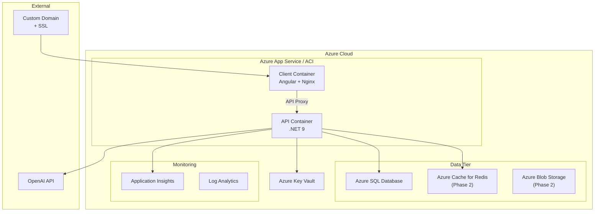

---

## 30. Azure Deployment Plan

### MVP Azure Resources

| Resource | Service | Tier | Estimated Monthly Cost |
|---|---|---|---|
| **API** | Azure App Service | B1 (Basic) | ~$13/mo |
| **Database** | Azure SQL Database | Basic (5 DTUs) | ~$5/mo |
| **Frontend** | Azure Static Web Apps | Free tier | $0 |
| **Key Vault** | Azure Key Vault | Standard | ~$0.03/mo |
| **Total MVP** | | | **~$18/mo** |

### Phase 2 Additions

| Resource | Service | Tier |
|---|---|---|
| Redis | Azure Cache for Redis | Basic C0 (~$16/mo) |
| Storage | Azure Blob Storage | LRS (~$1/mo) |
| Monitoring | Application Insights | Free tier (5GB/mo) |

### CI/CD Pipeline (GitHub Actions)

```yaml
# .github/workflows/deploy.yml
name: Build and Deploy
on:
  push:
    branches: [main]

jobs:
  build-and-deploy:
    runs-on: ubuntu-latest
    steps:
      - uses: actions/checkout@v4

      # Backend
      - name: Build .NET
        run: dotnet publish src/SalesAI.API -c Release -o ./publish

      - name: Build Docker Image
        run: docker build -t salesai-api ./publish

      - name: Push to Azure Container Registry
        run: |
          az acr login --name salesaiacr
          docker tag salesai-api salesaiacr.azurecr.io/salesai-api:latest
          docker push salesaiacr.azurecr.io/salesai-api:latest

      # Frontend
      - name: Build Angular
        working-directory: ./salesai-client
        run: |
          npm ci
          npm run build -- --configuration production

      - name: Deploy to Static Web Apps
        uses: Azure/static-web-apps-deploy@v1
```

---

## 31. Docker Strategy

### docker-compose.yml

```yaml
version: '3.8'

services:
  salesai-api:
    build:
      context: .
      dockerfile: src/SalesAI.API/Dockerfile
    ports:
      - "5000:8080"
    environment:
      - ASPNETCORE_ENVIRONMENT=Development
      - ConnectionStrings__DefaultConnection=Server=sqlserver;Database=SalesAI;User=sa;Password=${SA_PASSWORD};TrustServerCertificate=true
      - JwtSettings__Secret=${JWT_SECRET}
      - OpenAI__ApiKey=${OPENAI_API_KEY}
    depends_on:
      sqlserver:
        condition: service_healthy
    networks:
      - salesai-network

  salesai-client:
    build:
      context: ./salesai-client
      dockerfile: Dockerfile
    ports:
      - "4200:80"
    depends_on:
      - salesai-api
    networks:
      - salesai-network

  sqlserver:
    image: mcr.microsoft.com/mssql/server:2022-latest
    environment:
      - ACCEPT_EULA=Y
      - SA_PASSWORD=${SA_PASSWORD}
      - MSSQL_PID=Developer
    ports:
      - "1433:1433"
    volumes:
      - sqlserver-data:/var/opt/mssql
    healthcheck:
      test: /opt/mssql-tools18/bin/sqlcmd -S localhost -U sa -P "$$SA_PASSWORD" -Q "SELECT 1" -C -b
      interval: 10s
      timeout: 5s
      retries: 5
    networks:
      - salesai-network

volumes:
  sqlserver-data:

networks:
  salesai-network:
    driver: bridge
```

### API Dockerfile

```dockerfile
# Build stage
FROM mcr.microsoft.com/dotnet/sdk:9.0 AS build
WORKDIR /src

COPY ["SalesAI.sln", "."]
COPY ["src/SalesAI.Domain/SalesAI.Domain.csproj", "src/SalesAI.Domain/"]
COPY ["src/SalesAI.Application/SalesAI.Application.csproj", "src/SalesAI.Application/"]
COPY ["src/SalesAI.Infrastructure/SalesAI.Infrastructure.csproj", "src/SalesAI.Infrastructure/"]
COPY ["src/SalesAI.API/SalesAI.API.csproj", "src/SalesAI.API/"]
RUN dotnet restore

COPY . .
RUN dotnet publish "src/SalesAI.API/SalesAI.API.csproj" -c Release -o /app/publish

# Runtime stage
FROM mcr.microsoft.com/dotnet/aspnet:9.0 AS runtime
WORKDIR /app
COPY --from=build /app/publish .
EXPOSE 8080
ENTRYPOINT ["dotnet", "SalesAI.API.dll"]
```

### Angular Dockerfile

```dockerfile
# Build stage
FROM node:22-alpine AS build
WORKDIR /app
COPY package*.json ./
RUN npm ci
COPY . .
RUN npm run build -- --configuration production

# Runtime stage
FROM nginx:alpine
COPY --from=build /app/dist/salesai-client/browser /usr/share/nginx/html
COPY nginx.conf /etc/nginx/conf.d/default.conf
EXPOSE 80
```

---

## 32. Testing Strategy

### Testing Pyramid

```
          ╱╲
         ╱  ╲        E2E Tests (few — critical paths only)
        ╱────╲       - Login → Create Lead → See on Dashboard
       ╱      ╲
      ╱        ╲     Integration Tests (moderate — API + DB)
     ╱──────────╲    - Each endpoint with real DB (Testcontainers)
    ╱            ╲   - AI service with mocked OpenAI
   ╱              ╲
  ╱                ╲  Unit Tests (many — domain + handlers)
 ╱──────────────────╲ - Domain entity business rules
                       - MediatR handler logic
                       - Validation rules
```

### MVP Test Priorities

| Layer | Tool | Focus |
|---|---|---|
| **Domain Unit Tests** | xUnit + FluentAssertions | Value object validation, entity state transitions, business rules |
| **Handler Unit Tests** | xUnit + NSubstitute | Command/query handler logic with mocked DB context |
| **Validation Tests** | xUnit + FluentValidation.TestHelper | Every validator tested |
| **Integration Tests** | xUnit + Testcontainers + WebApplicationFactory | API endpoints against real SQL Server container |
| **AI Tests** | xUnit + mocked IAIService | Prompt template rendering, response parsing (not actual OpenAI calls) |
| **Frontend Unit** | Jasmine + Karma | Component rendering, service logic |
| **Frontend E2E** | Playwright (Phase 2) | Critical user journeys |

### Test Naming Convention

```csharp
// Method: Should_{ExpectedBehavior}_When_{Condition}
[Fact]
public async Task Should_ReturnHotScore_When_LeadIsDecisionMakerAtLargeCompany()

[Fact]
public async Task Should_ThrowValidationException_When_EmailIsEmpty()

[Fact]
public async Task Should_MoveDealToNextStage_When_StageTransitionIsValid()
```

---

## 33. Future Scalability Plan

### Architecture Evolution Path

```
MVP (Now)                    Phase 2                       Phase 3
┌──────────────────┐   ┌──────────────────┐    ┌──────────────────┐
│ Modular Monolith │   │ Modular Monolith │    │  Microservices   │
│ Single DB        │──→│ + Redis Cache    │──→ │  + Event Bus     │
│ Hangfire         │   │ + Multi-Tenant   │    │  + Azure Service │
│ Single Server    │   │ + Blob Storage   │    │    Bus           │
└──────────────────┘   └──────────────────┘    └──────────────────┘
```

### Scalability Hooks Built Into MVP

| Hook | Current State | Scales To |
|---|---|---|
| `IApplicationDbContext` interface | Single SQL Server | Read replicas, database-per-tenant |
| `ICacheService` interface | In-memory stub | Redis / Memcached |
| `IAIService` interface | OpenAI direct | Azure OpenAI, local models, multi-provider |
| `IEmailService` interface | SMTP / stub | SendGrid, SES, queued email |
| Domain events via MediatR | In-process handlers | MassTransit + RabbitMQ / Azure Service Bus |
| Hangfire jobs | Single server | Multi-server with distributed locks |
| `TenantId` on entities (nullable) | Ignored | Row-Level Security, tenant middleware |
| Feature-based folder structure | Single deployment | Extract to independent services |

### Database Scalability Path

1. **MVP**: Single SQL Server database
2. **Phase 2**: Add Redis for dashboard caching and session data
3. **Phase 3**: Read replica for reports, partitioning for Activities/Audit tables
4. **Phase 4**: Consider database-per-tenant for enterprise customers

---

## 34. Technical Risks

| Risk | Likelihood | Impact | Mitigation |
|---|---|---|---|
| **OpenAI API rate limits** | Medium | Medium | Implement retry with backoff + circuit breaker. Cache AI results. Use batch processing for scoring |
| **OpenAI API costs spiral** | Medium | High | Use GPT-4o-mini by default. Track tokens per request in `AIGeneratedContent` table. Set spending alerts |
| **AI hallucinations** | High | Medium | Enforce JSON schema responses. Display "AI-generated" badges. Allow user to edit/reject AI output |
| **OpenAI API downtime** | Low | High | Circuit breaker pattern. Graceful degradation (features work without AI, just no AI enrichment) |
| **SQL Server performance under load** | Low (MVP) | Medium | Proper indexing strategy. Paginated queries. Dashboard queries optimized with materialized views later |
| **JWT token theft** | Low | High | Short access token lifetime (15 min). Refresh token rotation. HTTPS only |
| **Scope creep** | High | High | Ruthless MVP scope. Phase 2 backlog clearly separated. No new features without cutting existing ones |
| **EF Core N+1 queries** | Medium | Medium | Use `.Include()` explicitly. Monitor with MiniProfiler in dev. Log slow queries |
| **Angular bundle size** | Low | Medium | Lazy loading all feature routes. Tree shaking. Monitor with `source-map-explorer` |

---

## 35. Nice-to-Have Features

These are features that would improve the product but are not required for MVP. If time permits on Day 7, consider adding the highest-value items.

| Feature | Value | Effort | Notes |
|---|---|---|---|
| **Real-time notifications (SignalR)** | High | Medium | Push notifications when AI scoring completes, new leads assigned |
| **Dark/Light theme toggle** | Medium | Low | CSS variables already support it |
| **Bulk actions on leads** | Medium | Low | Select multiple → assign, tag, delete |
| **Lead activity heatmap** | Medium | Medium | Calendar view showing engagement intensity |
| **Export reports to PDF** | Medium | Medium | `QuestPDF` library on backend |
| **API documentation (Swagger UI)** | High | Low | Already comes with ASP.NET Core — just polish |
| **Keyboard shortcuts** | Low | Low | `Ctrl+K` command palette for power users |
| **Audit log viewer** | Medium | Medium | Page showing who changed what, when |
| **Custom lead/deal fields** | High | High | JSON column or EAV pattern |
| **Email template library** | Medium | Medium | Pre-built templates the AI can customize |

---

## Open Questions

> [!IMPORTANT]
> **These questions affect implementation decisions. Please review:**

1. **OpenAI API Key**: Do you have an OpenAI API key, or should I design with a mock AI service that returns realistic fake data for demo purposes?

2. **AI Model Preference**: Are you comfortable with the recommended GPT-4o-mini (fast, cheap) for most features and GPT-4o for complex analysis? Or do you prefer a different provider (Azure OpenAI, Anthropic Claude, etc.)?

3. **Tailwind CSS Version**: You specified Tailwind CSS. Should I use Tailwind v3 (stable, widely used) or Tailwind v4 (newer, CSS-first configuration)?

4. **SQL Server Setup**: For local development, should I use SQL Server via Docker (recommended, works on any OS) or do you have SQL Server LocalDB / Express installed?

5. **Email Service**: For the notification emails in automation workflows, should I use a real SMTP service (SendGrid free tier) or just log/store the emails in the database for MVP demo purposes?

6. **Deployment Priority**: Do you want Docker-only local development for now, or should I also set up Azure deployment pipeline from the start?

---

> **This plan is ready for your review.** Once you approve (with any modifications), I will begin implementation following the phased approach outlined in the Sprint Plan.
